# Learning OCaml

İlk programlama dilinden bu zamanlara değişen çok şey var. Üniversite yıllarım kişisel bilgisayarların ve internetin yaygınlaştığı World Wide Web devrimine denk geliyor. O vakitler bölümde gösterilen bilgisayar programlama derslerini düşünüyorum da; [GW-Basic](https://en.wikipedia.org/wiki/GW-BASIC), [Cobol](https://en.wikipedia.org/wiki/COBOL), C ve C++ ... Çoğunda belli seviyeye kadar geldiğimizi anımsıyorum. Aynı yıllarda iş dünyasının hızlandırıcı etkisine de şahit olmuştuk. Sadece klavye ve 8 renkten oluşan siyah terminal ekranları çok uzun zamandır mouse imleçleri ile renklenmişti. Dahası artık iş süreçlerinin internet ortamından yürütülebildiği bir dönemdi. Bu dalga ile birlikte ben ve birçok arkadaşım **Delphi**, **Java**, **Visual Basic** gibi diller yöneldi. Ben ağırlıklı olarak Delphi tarafına yakındım ama zamanla bu yerini **C#** programlama diline bıraktı.

Anılar bir kenara dursun yıllarca popüler dillerle uygulama geliştirmenin ardından gelen bir farkındalık, araçlara değil, o araçları var eden felsefeye odaklanmam gerektiğini öğretti. Bazı programlama dillerini iş amaçlı kullanmak için değil, atası olduğu diğer dillere kattığı özellikleri düşünerek çalışmak gerekiyor. Örneğin uzun süre uğraştığım ve sahada deneyimleme şansını çok bulamadığım için şimdilerde paslandığım **Rust** programlama dili atası olan **OCaml** dilinden birçok özellik almıştı *(Güçlü tip sistemler, cebirsel veri tipleri - algebraic data types, hata payını azaltan örüntü eşleştirme - pattern matching, options vb)* Benzer şekilde **Scala**, **F#** ve bugünlerde dikkat çeken **Rocq**, **Gleam** gibi dillere de **OCaml** ilham vermişti. **OCaml** ile herhangi bir proje geliştirmeyeceğim veya onu iş yerinde kullanmayacağım ama fonksiyonel dil paradigmasını anlamak, bir derleyicinin ya da yorumlayıcının nasıl yazıldığını temelden öğrenmek ve birçok dilin **Ocaml** üzerinden aldığı kabiliyetleri kavramak için geç de olsa çalışmalıyım *(Sen bu yazıyı okuyan bir üniversite talebesi isen bence sende OCaml veya benzeri bazı dilleri iyice öğrenmeye çalışmalısın)*

> F# programlama dilinin doğrudan bir türevi olduğu, Rust'ın tip güvenliği felsefesini benimsediği ve hatta ilk derleyicisinin OCaml ile yazıldığı düşünüldüğünde; OCaml öğrenmek modern programlama dillerinin genetik kodunu çözmek demektir.

Sözün özü bu tamamen kendi zihinsel yatırımım ve itiraf etmeliyim ki bu yatırımı ellili yaşlarımda değil de yirmili yaşlarımda değerlendirmem gerekirdi.

- [Giriş](#learning-ocaml)
  - [Merak Ettiklerim](#merak-ettiklerim)
  - [Kurulumlar](#kurulumlar)
  - [Giriş Seviyesi](#giriş-seviyesi)
    - [Basit aritmetik işlemler, değişken atamaları ve isimlendirmeler](#basit-aritmetik-işlemler-değişken-atamaları-ve-isimlendirmeler)
    - [let'in Gücü ve Fonksiyon Tanımlamaları](#letin-gücü-ve-fonksiyon-tanımlamaları)
    - [Yine de Float.0 ile Çalışmak Gerekirse](#yine-de-float0-ile-çalışmak-gerekirse)
    - [Zihin Yakan Bir Fonksiyon Kullanımı](#zihin-yakan-bir-fonksiyon-kullanımı)
    - [Fonksiyonlarda Generic Parametre Kullanımı](#fonksiyonlarda-generic-parametre-kullanımı)
    - [Tuple, List ve Options veri türleri](#tuple-list-ve-options-veri-türleri)
    - [Record Veri Yapısı ve Variant Tipler](#record-veri-yapısı-ve-variant-tipler)
    - [Döngüsüz Olmaz Tabii *(for, while loops)*](#döngüsüz-olmaz-tabii-for-while-loops)
    - [Derleyerek Çalıştırmak](#derleyerek-çalıştırmak)
    - [Alcotest ile Birim Test Yazmak](#alcotest-ile-birim-test-yazmak)
  - [Biraz da Felsefe](#biraz-da-felsefe)
    - [Hata Yapmayı İmkansız Kılan Tip Desteği(Type Safety Değil Type Expressiveness)](#hata-yapmayı-i̇mkansız-kılan-tip-desteği-type-safety-değil-type-expressiveness)
    - [Olabildiğince Fonksiyonel](#olabildiğince-fonksiyonel)
    - [Tony Hoare Anısına](#tony-hoare-anısına)
    - [Yüksek Matematik Lisanslı Derleyici](#yüksek-matematik-lisanslı-derleyici)

## Merak Ettiklerim

- **OCaml ismi nerden geliyor?:** OCaml, "Objective Caml" ifadesinin kısaltması. Caml *( Categorical Abstract Machine Language)* diline nesne yönelimli programlama özelliklerinin eklenmiş bir versiyonu olarak düşünebiliriz ve evet logosunda deve var elbetteki :D
- **Geliştiricileri kim?:** INRIA *(Institut National de Recherche en Informatique et en Automatique - Ulusal Bilgisayar Bilimi ve Otomasyon Araştırma Enstitüsü)* 'dan Xavier Leroy, Jérôme Vouillon, Damien Doligez ve Didier Rémy tarafından geliştirilmiş. Fransızlar tarafından geliştirildiği için söz dizimine yer yer fransız kaldığım da olmadı değil :D
- **İlk versiyonu ne zaman çıktı?:** Kaynaklara göre ilk sürüm **1996** yılında piyasaya sürülmüş. Dokümanı yazdığım an itibariyle de son sürümü 2025-10-09 tarihinde yayınlanmış olan **5.4.0** versiyonu. Son sürümde **immutable diziler**, **labelled tuple** türleri, **atomik record** alanları gibi yeni özellikler eklenmiş.
- **Dilin kullanım amacı:** Genel amaçlı bir programlama dili olduğunu düşünebiliriz zira nesne yönelimli olma hali ve fonksiyonel dil özellikleri ile birlikte pragmatik yaklaşımları içeriyor. Genelleştirilmiş çöp toplayıcısı *(Garbage Collector)*, birinci sınıf fonksiyonlar *(First Citizen Functions)*, statik tür sistemi *(Static Type System)*, immutable programlama taktikleri, tip çıkarımı *(Type Inference)*, cebirsel veri türleri *(Algebraic Data Types)*, örüntü eşleştirme *(pattern matching)* ve daha birçok özelliği destekleyen bir dil.
- **Hangi dillerden esinlenmiş:** Sahip olduğu özellikler de düşünüldüğünde **Caml** başta olmak üzere, **C**, **Pascal**, **Modula-3** ve **Standard ML** dillerinden esinlenildiği belirtiliyor.
- **Hangi dillere esin kaynağı olmuş:** Bir tanesi *[Rust](https://rust-lang.org/)* ki bende uğraştığım için biliyorum. Wikipedia kayıtlarına göre OCaml'dan etkilenen diğer diller arasında [Rocq](https://rocq-prover.org/), [F#](https://fsharp.org/), [Scala](https://www.scala-lang.org/), [Gleam](https://gleam.run/) gibi popüler diller de var.
- **OCaml ile kendi programlama dilini yazabilir miyim?:** Teorik olarak evet, **OCaml** güçlü bir dil ve kendi dilinizi yazmak için gerekli araçları sağlayabilir. Zaten Rust'ın ilk sürümü bildiğim kadarı ile OCaml ile yazılıyor.
- **Hangi kaynaklardan öğrenebilirim?:** [Real World OCaml, Functional Programming for the Masses, Anıl Madhavapeddy, Yaron Minsky, Cambridge University Press](https://dev.realworldocaml.org/index.html) Heybetli bir kitap. Gerçekten 20li yaşlarımda olmam gerekiyor :D Bunun yanında **Cornell** Üniversitesinden **Michael Ryan Clarkson**'ın 2021 yılında yayınladığı [OCaml Programming: Correct + Efficient + Beautiful](https://youtube.com/playlist?list=PLre5AT9JnKShBOPeuiD9b-I4XROIJhkIU&si=fqYdWGlXmQwy8c_b) kursunu da tavsiye ederim. Ben 25 yıl kadar geç başlıyorum bazı şeylere doğrudur :D Ayrıca bu yayına ait güzel bir [kitap](https://cs3110.github.io/textbook/cover.html) da var.

## Kurulumlar

İlk olarak resmi [OCaml web sitesinden](https://ocaml.org/docs/installing-ocaml) gerekli kurulumları yapmak lazım. Ayrıca **VS Code** editörüne **OCaml** eklentisini yüklemekte yarar var.

### Windows 11 Tarafında Sorun

Windows 11 işletim sisteminde gerekli kurulumları yapmış olmama rağmen komut satırından **ocaml** ile kod çalıştırmakta sorun yaşadım. Bunun kalıcı çözümü içinse aşağıdaki komutu işlettim.

```bash
Add-Content $PROFILE "`n# Initialize opam environment`n(& opam env) -split '\r?\n' | ForEach-Object { Invoke-Expression `$_ }"

#Sonrasında PowerShell'i yeniden başlattım
#Kısa bir versiyon kontrolü yaptım
ocaml -version

#ve örneğin hello-world.ml dosyasını doğrudan aşağıdaki komutla çalıştırabildim
ocaml hello-world.ml

#Ocaml' ı interaktif modda kullanmak için ise aşağıdaki komutu kullanmak yeterli
ocaml
```

İşte ilk programın çıktısı,

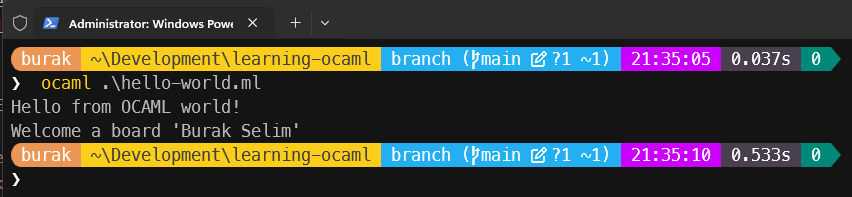

### WSL Tarafında Ubuntu Üzerinden Çalışmak

Nedense bu tip dilleri çalışmak için en uygun platform **Linux** ortamı sanırım *(Emektar Ubuntu sistemim Westworld tavan arasında ama Windows'ta WSL ile bir ubuntu üzerinde çalışmak mümkün)* Ben tüm çalışmalardan sonra konu tekrarları için **WSL** üzerinden ilerlemeye karar verdim. Hali hazırda WSL üzerinde bir **Ubuntu** sürümüm yüklü. Ancak değilse de,

```bash
wsl --install -d Ubuntu
# ile ubuntu'yu yükleyebiliriz.
```

**Ocaml** kurulmarı içinse aşağıdaki adımları takip etmek gerekiyor.

```bash
# Öncelikle apt paket yöneticisini güncelleyelim
sudo apt update
# Şimdi de apt software paketlerini güncelleyelim
sudo apt upgrade -y
# İşimize yarayacak bazı paketleri de yükleyelim
sudo apt install -y zip unzip build-essential

sudo apt install opam
opam init --bare -a -y
# Bir ihtimal opam'ın update edilmesine dair bir uyarı gelebilir. O vakit,
opam update

# Güncel bir OCaml sürümü ile çalışmak için aşağıdaki komutu kullanarak bir switch oluşturabiliriz
opam switch create ocaml-5.3 ocaml-base-compiler.5.3.0
# Terminalimizinn yeni switch'i tanıması için aşağıdaki komutu çalıştırmakta fayda var
eval $(opam env)
# switch listesini görmek için
opam switch list

# Şimdi opam için gerekli paketleri yükleyelim
opam install -y utop odoc ounit2 qcheck bisect_ppx menhir ocaml-lsp-server ocamlformat

# Şu noktada ocaml universal TopLevel aracı olan utop'u kullanarak interaktif bir şekilde OCaml kodu yazabiliriz
utop
```

Eğer her şey yolunda giderse ubuntu ortamında **utop** ile doğrudan **ocaml** kodlamaya başlanabilir. Mesela,

```ocaml
# 3.1415;;
- : float = 3.1415
# #quit;;
```

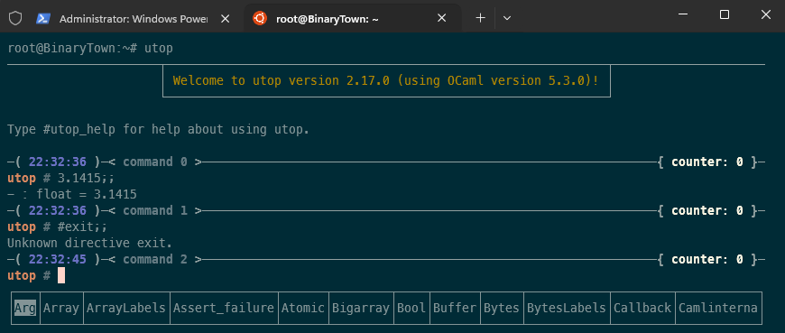

## Giriş Seviyesi

Aşağıdaki kod örnekleri için komut satırından **ocaml** komutu çalıştırılarak ilerlenebilir. Ayrıca **utop** aracı ile de çalışılabilir. Bu ikisi özellikle yazılan kodun anında çalıştırılması ve sonuçların görülmesi açısından faydalı araçlar. **utop**, daha gelişmiş özelliklere sahip bir **TopLevel** aracı olarak düşünülebilir ancak bir noktadan sonra **ml** uzantılı dosyalar üzerinden çalışmaya döndüğümü de belirtmek isterim. **TopLevel** bir nevi **REPL *(Read-Eval-Print Loop)*** aracı. Çok büyük çaplı olmayan kod parçalarını denemek için, özellikle dilin temel özelliklerini giriş seviyesinde öğrenirken oldukça kullanışlı bir araç. Yazılan bir ifadenin dil tarafından nasıl yorumlamdığını anında gösteriyor zira.

### Bazı Yararlı Utop Komutları

- **#help;;** : Utop'ta kullanılabilecek komutları gösterir.
- **CTRL + L** : Ekranı temizler. Bir noktadan sonra terminal ekranı çok kirlenirse silmek için ;)
- **#quit;;** : Utop oturumunu sonlandırır.
- **#show {module_name};;** : Belirtilen modülün içeriğini gösterir. Örneğin **#show List;;** komutu ile **List** modülünün içeriği görülebilir.
- **#use "filename.ml";;** : Belirtilen dosyayı yükler ve içindeki kodu çalıştırır. Dosya uzantısı **.ml** olmalıdır. Örneğin aşağıdaki içeriğe sahip bir **ml** dosyamız olduğunu düşünelim. *(Clarkson'un öğretisine bağlı kalarak WSL ortamında 3110 isimli bir klasör oluşturup içine bu dosyayı koydum)*

```ocaml
let x : int = 3110;;
print_int x;;
print_string "Hello, world!\n";;
```

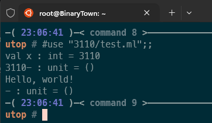

### Basit aritmetik işlemler, değişken atamaları ve isimlendirmeler

Öyleyse ders notlarımıza başlayalım. İlk olarak **float** değerler ile ilgili aritmetik birkaç işleme bakalım. Deneyeceğimi ifadeleri aşağıdaki kod bloğuna ekliyorum. Bunları **utop** aracından denersek çok faydalı olacaktır.

```ocaml
3.14 +. 2.1;;
10+2;;
10+.2;;
(* 
  Line 1, characters 0-2: 
  1 | 10+.2;;
      ^^
  Error: The constant 10 has type int but an expression was expected of type
          float
  Hint: Did you mean 10.?
*)
10. +. 2;;
(*
  Line 1, characters 7-8:
  1 | 10. +. 2;;
            ^
  Error: The constant 2 has type int but an expression was expected of type
          float
  Hint: Did you mean 2.?
*)
10. +. 2.;;
1_000_000 * 10_000;;
(2 * 5) <= 10;;
(2 * 6) <= 10;;
let xValue = 10;;
let y_value = 5;;
let result = xValue + y_value;;
let MaxUserCount = 8;;
(*
  Line 1, characters 4-16:
  1 | let MaxUserCount = 8;;
          ^^^^^^^^^^^^
  Error: Unbound constructor MaxUserCount
*)
let 7even = 7;;
(*
  Line 1, characters 4-9:
  1 | let 7even = 7;;
          ^^^^^
  Error: Invalid literal 7even
*)
let screen-width = 1024;;
(*
  Line 1, characters 11-16:
  1 | let screen-width = 1024;;
                ^^^^^
  Error: Syntax error
*)
```

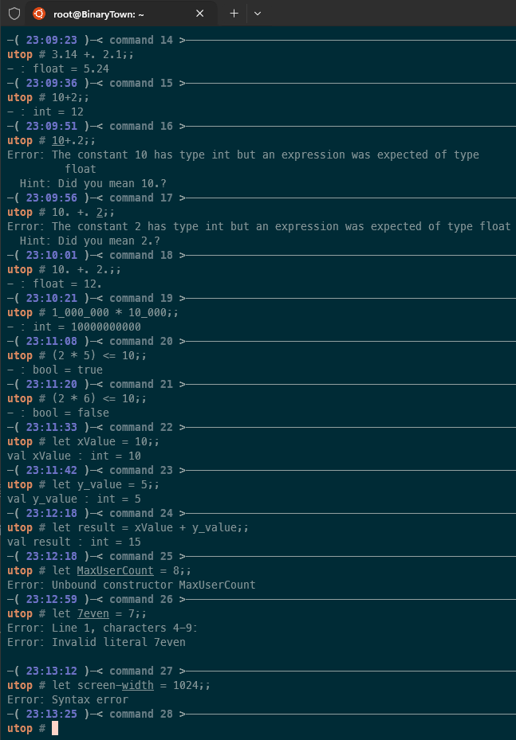

- **;;** ile toplevel'a ilgili satırı bir ifade olarak ele alması gerektiğini, yani hemen çalıştırmasını belirtmek için kullanılıyor. *(Evaluate Expression)*
- İki **float** değeri toplamak için **+.** operatörü kullanılmalı. Ayrıca **float** ve **int** toplanacaksa küsürat olmasa bile . işareti ile sayının **float** olarak ele alınacağı ifade edilmeli.
- İfade çalıştırıldığında sadece sonuç değil tür bilgisi de dönülüyor.
- Büyük sayılar **_** karakteri ile daha okunabilir yazılabilir.
- Değişkenleri **let** anahtar kelimesi ile tanımlayabilir ilk değerleri atayabiliriz.
- Değişken isimlendirme kurallarına göre büyük harfle, sayıyla başlayan değişken adları verilemez *(MaxUserCount, 7even)* gibi. Büyük harf kullanılmama sebebi, modül adlarının büyük harfle başlaması olabilir.
- Hatta değişken isimlendirmelerinde **-** operatörü de kullanılamaz.

### let'in Gücü ve Fonksiyon Tanımlamaları

Başka işlemlerle devam edelim. **let** çok güçlü bir operatör. Değişkenleri değerlere bağlayabildiğimiz gibi, fonksiyonları da iş yapan kod bloklarına bağlayabiliriz.

```ocaml
let total x y = x + y;;
total 1 5;;
total -5 5;;
(*
  Line 1, characters 0-5:
  1 | total -5 5;;
      ^^^^^
  Error: The value total has type int -> int -> int
        but an expression was expected of type int
*)
total (-5) 5;;
total 1.2 3.4;;
(*
  Line 1, characters 6-9:
  1 | total 1.2 3.4;;
            ^^^
  Error: The constant 1.2 has type float but an expression was expected of type
          int
*)
# total 128 (8 * 1024);;
```

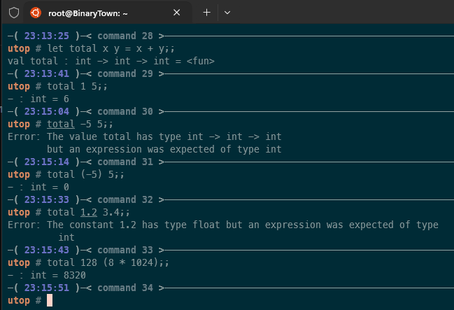

Burada **total** isimli iki parametre alan ve varsayılan olarak **int** türünden değerleri toplayan bir fonksiyon tanımladık. Fonksiyon çağrılırken parametreler arasında parantez kullanımı önemli. Aksi halde eksi işareti operatör olarak algılanıyor. Ayrıca doğru türlerde işlem yapmak lazım. Yeni ifadelerle devam edelim;

```ocaml
let total_1 x y = x + y;;
let total_2 x y = (x * x) + (y * y);;
total_1 3 4 + total_2 5 1;;
let div x y = Float.from_int x / Float.from_int y;;
(*
  Line 1, characters 14-28:
  1 | let div x y = Float.from_int x / Float.from_int y;;
                    ^^^^^^^^^^^^^^
  Error: Unbound value Float.from_int
  Hint:   Did you mean Float.of_int or Float.to_int?
*)
let div x y = Float.of_int x / Float.of_int y;;
(*
  Line 1, characters 14-28:
  1 | let div x y = Float.of_int x / Float.of_int y;;
                    ^^^^^^^^^^^^^^
  Error: This expression has type float but an expression was expected of type
          int
*)
let div x y = Float.of_int x /. Float.of_int y;;
div 1 3 
;;
div 3.14 2. 
;;
(*
  Line 1, characters 4-8:
  1 | div 3.14 2.
          ^^^^
  Error: The constant 3.14 has type float
        but an expression was expected of type int
*)
# div 3 2;;
```

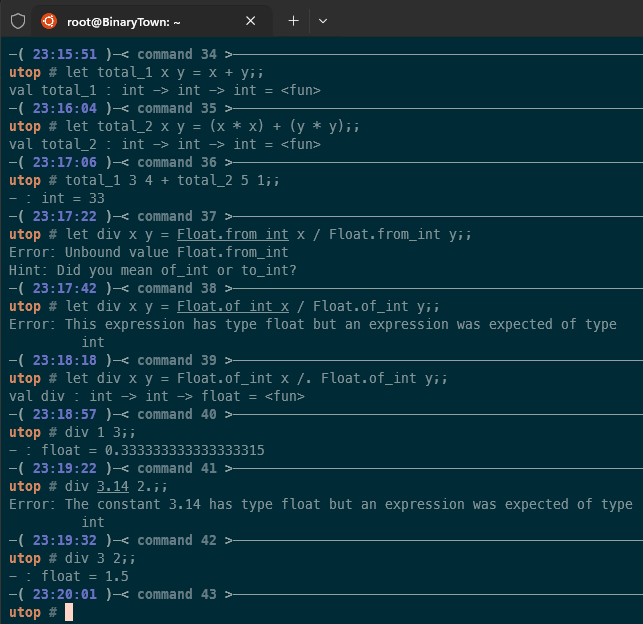

> div fonksiyonunun yorumlanma şekli dikkatinizi çekmiştir. int -> int -> float. Düşününce int,int -> float gibi bir şey yazar diye bekliyor insan değil mi?

Yukarıdaki örnekte, **div** isimli fonksiyonu tanımlamaya çalışıyoruz. Fonksiyondan beklenti **int** türünden gelen iki sayıyı bölmek ama bunları **float** türünden ele almasını sağlamak. İlk denemede kitaptaki fonksiyon adını unuttum ve **of_int** yerine **from_int** yazdım. **Rust** günlüklerim geldi aklıma, yorumlayıcı *acaba şunu mu demek istedin* derdi. Fonksiyonları düzelttikten sonra **/** operatörü ile **/.** arasındaki farka tosladım. **float** türler arasında bir bölme işlemi söz konusu olacağı için **/.** operatörünün kullanılması gerekiyormuş. Bölme operatörünün tipe özel versiyonlandığını ifade edebiliriz. Ayrıca **Float** bir Ocaml modülüdür *(Büyük harfle başlayan isimler modülleri ifade eder)* ve bu modülün içinde **of_int** isimli bir fonksiyon var. Bu fonksiyonun görevi **int** türünden bir değeri **float** türüne çevirmek.

Burada rahatsız edici nokta belki de **Float.of_int** kullanımı olabilir ama bunu kolaylaştırmak için **OCaml** ekosisteminde yazılmış bir başka [modül](https://ocaml.janestreet.com/ocaml-core/v0.13/doc/base/Base/Float/O/) var. Bu modüldeki amaçlardan birisi **float** değerler ile çalışırken **+.**, **/.** operatörleri yerine **+**, **/** */ ile de çalışabilmek ve bunu **float-safe** modda yapabilmek. Biz şu an için standart kütüphane ile devam edebiliriz. Ekosistemdeki diğer modüllere sonradan odaklanırız. Standart kütühane aynı fonksiyonu aşağıdaki gibi yazmamıza da izin veriyor.

```ocaml
let div x y =
        float_of_int x /. float_of_int y
;;
div 1 5;;
```

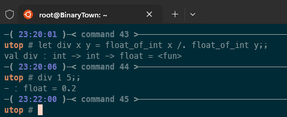

#### Yine de Float.0 ile Çalışmak Gerekirse

Bir noktada **Float.O** ile çalışmak gerekirse şöyle ilerlemek gerekiyor. Öncelikle komut satırından **utop** başlatılır. Ardından, **toplevel**, **Base** modülünü destekleyecek şekilde başlatılır. Bu işlemin ardından ilgili fonksiyon yazılabilir. Aşağıdaki ekran görüntüsünü geleceğe not olarak bırakalım.

> Burada dikkat edilmesi gereken bir nokta da **Float.O** ifadesindeki O'nun büyük harf O olduğudur. 0 (sıfır) değil :D

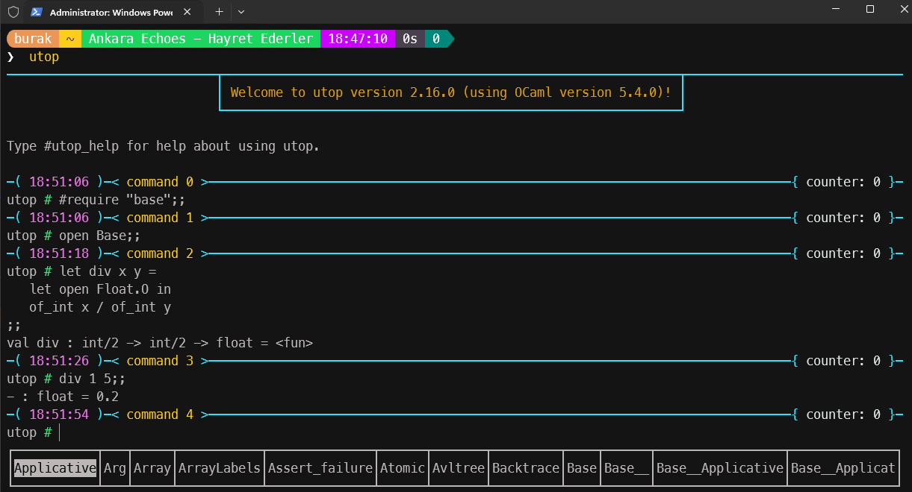

Gelecekten geldim :D **WSL - Ubuntu** tarafından da bir bakalım.

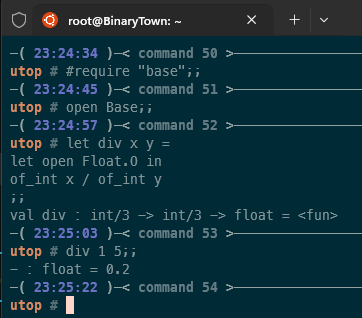

### Zihin Yakan Bir Fonksiyon Kullanımı

Şimdi, **int** türünden değer dönen bir fonksiyonu parametre olarak alan ve diğer parametreden gelen **int** değer ile toplayan bir fonksiyon tanımlayıp çalıştıralım.

```ocaml
let more_add f x y = f * x + y;;
let square n = n * n;;
more_add (square 1) 1 1;;
more_add (square 2) 3 5;;
```

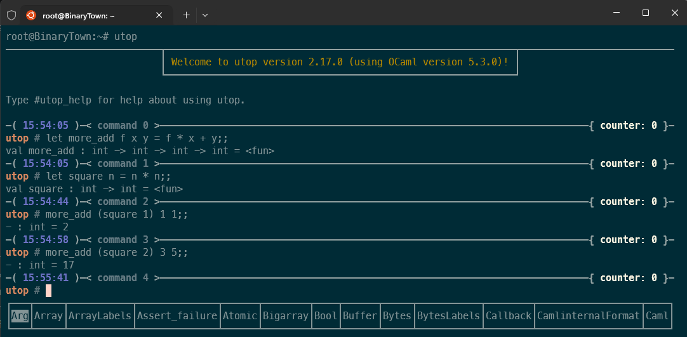

İlk olarak **more_add** fonksiyonuna bir bakalım. **f** harfinin bir fonksiyonu işaret ettiğini nereden anladı? Yorumlama kısmına baktığımızda **int -> int -> int -> int** şeklinde bir tanım var. `<fun\>` tabii ki bunun bir fonksiyon olduğunu ifade etmekte. **f** çıktısını x ile çarpıp y ile toplatıyoruz. Saçma bir fonksiyon ancak dinamiğini öğrenmek açısından kayda değer. Sonrasında **square** isimli bir fonksiyon daha tanımlıyoruz. Bu fonksiyon tek parametre alıyor ve karesini döndürüyor. Şimdi **more_add** fonksiyonunu çağırırken ilk parametre olarak **square 2** ifadesini veriyoruz. Bu ifade **4** değerini döndürecek ve bu değer **f** parametresine bağlanacak. Sonrasında ise 3 ve 5 değerleri sırasıyla x ve y parametrelerine bağlanacak. Yani fonksiyonun işleyişi şu şekilde olacak, 4 * 3 + 5 = 12 + 5 = 17. Ancak asıl zihin yakıcı örnek kitaptaki örnekten esinlenilerek geliyor;

```ocaml
let condition f first_arg second_arg =
      (if f first_arg then first_arg else 0)
      +
      (if f second_arg then second_arg else 0);;
let check_point value = value > 50;;
condition check_point 28 76;;
```

**condition** isimli fonksiyonun kullandığı **f** parametresi bir fonksiyonu işaret etmekte ve bu fonksiyonun türü **int -> bool**. Yani bir **int** alıp **bool** döndüren bir fonksiyon. Peki yorumlayıcı buna nasıl karar verdi ya da bu tür tahminini *(type inference)* neye göre yaptı? Bunu anlamak için **if** koşuluna odaklanmakta fayda var. Nitekim **else** kısımlarında 0 değeri kullanılmakta ki bu bir **int** türü. Buna göre **then** kısımlarında da **int** türü döndüren ifadeler olmalı. Sonuç olarak **f** fonksiyonu **int -> bool** türünde bir fonksiyon olmalı.

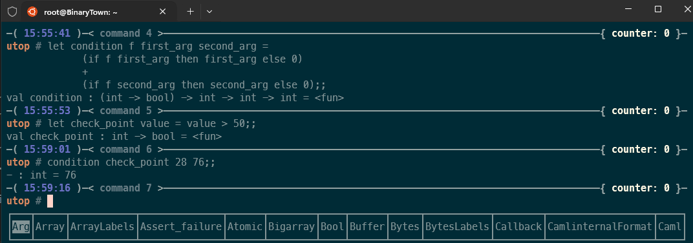

**OCaml** uzmanlarına göre bu yazım stiline ve yorumlayıcının tip tahmini mekanizmasına alışmak zaman alabilir. Diğer yandan dilin çok güçlü bir yanını ispat eden bu yazım stiline alışamayanlar için *Annotations* yani tür açıklamaları ile fonksiyonları tanımlamak da mümkün. Aynı fonksiyonu aşağıdaki gibi de yazabiliriz.

```ocaml
let condition (f: int -> bool) (first_arg:int) (second_arg:int) : int =
      (if f first_arg then first_arg else 0)
      +
      (if f second_arg then second_arg else 0);;
let check_point value = value > 50;;
condition check_point 28 76;;
```

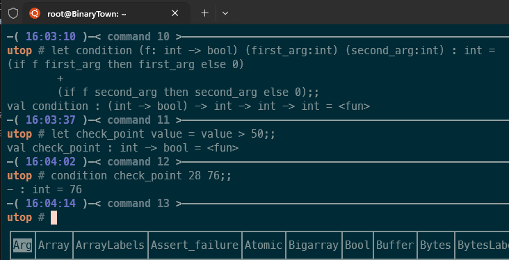

### Fonksiyonlarda Generic Parametre Kullanımı

**OCaml** tür tahmini yapma konusundaki hünerini **generic** türler için de gösterir. Aşağıdaki ifadeleri deneyerek devam edelim.

```ocaml
let identity value = value;;
identity 1001;;
identity "PRD-0001";;
let swap (left,right) = (right,left);;
swap (4,"four");;
```

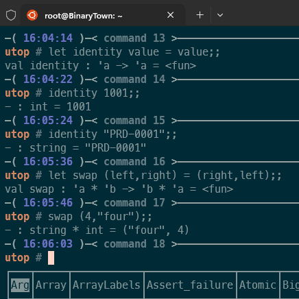

**identity** ve **swap** isimli fonksiyonlar tnaımlandıktan sonra yorumlayıcının verdiği çıktılara dikkat edelim. *(Açıkçası Rust'ı öğrenmeye başladığımda hem kavramsal olarak hem de sentaks olarak zorlandığım 'a - lifetime annotations konusu geldi aklıma)* Her neyse, **'a** ve **'b** şeklinde yazılan ifadeler **generic** türler. Generic kavramına aşina olmayanlar için *a ve b yerine herhangi bir tür gelebilir ve bunun için her bir türe özel olacak şekilde bu fonksiyonunun farklı versiyonlarını yazmanıza gerek yoktur* diyelim. Şimdi biraz daha kafa karıştırabilecek bir örnek.

```ocaml
let compare f arg_1 arg_2 = if f arg_1 then arg_1 else arg_2;;
let str_len string = String.length string > 8;;
compare str_len "Some..." "Something happens";;
let is_pass score = score > 70;;
compare is_pass 68 50;;
compare is_pass "Black" "And White";;
(*)
  1 | compare is_pass "Black" "And White";;
                      ^^^^^^^
  Error: This constant has type string but an expression was expected of type
          int
*)
```

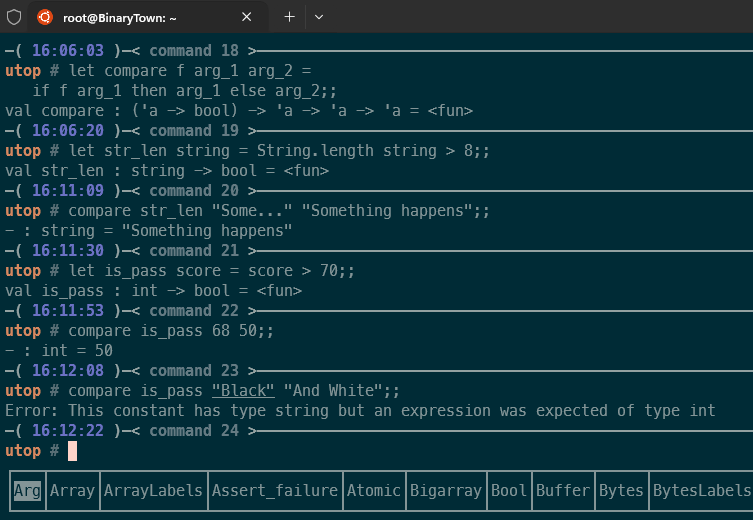

**compare** isimli fonksiyonumuz bir fonksiyon alıp diğer iki argümanı da hesaba katarak bir **if** koşulu işletmekte. **compare** fonksiyonundaki parametrelerin generic **'a** türü olarak yorumlandığa dikkat edelim. Sonraki adımlarda **str_len** ve **is_pass** isimli iki farklı fonksiyon daha tanımlanıyor. İlki, **String** modülünden **length** fonksiyonunu kullanarak bir değer döndürdüğü için **string** veri türü ile çalışacağı aşikar. Diğer fonksiyon ise sayısal bir karşılaştırma kullanıyor ve buna göre de **int** değerlerle çalışacağı anlaşılıyor. **compare** fonksiyonuna bu iki fonksiyonu parametre olarak verebiliriz ama devam eden argümanların da uygun tipler olması beklenir. Yani **str_len** kullanıyorsak diğer iki argümanın da **string** türünden olması gerekiyor.

### Tuple, List ve Options veri türleri

İlk olarak **tuple** veri türü ile ilgili basit örneklerle ilerleyelim. Aşağıdaki ifadeleri deneyebiliriz.

```ocaml
let config = ("He-Man, Gölgelerin gücü adına",1920,1080,true);;
let (title,width,height,is_active) = config;;
let move (x,y) speed = (x + speed , y + speed);;
move (10,15) 1;;
let (new_x,new_y) = move (11,16) 5;;
```

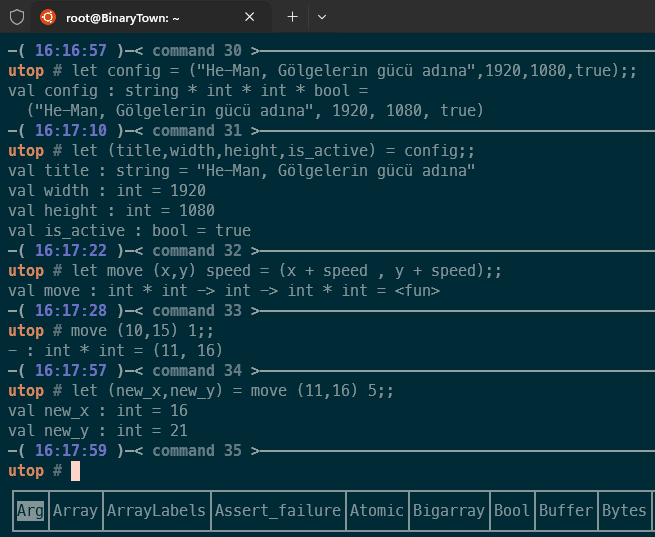

**config** isimli değişken bir tuple veri yapısını işaret ediyor. **Tuple** veri yapısı farklı türden değerler içerebilen zengin bir model. İstersek tanımladığımız config isimli tuple içeriğini **let** ile başka değişkenlere çıkartabiliriz *(export)* Burada **pattern matching** özelliğinin olduğunu da görebiliriz. **move** isimli fonksiyon da dikkate değer. İki parametre alıyor ancak x ve y koordinatlarını ifade eden ilk parametreyi bir tuple olarak tanımlıyor. Ayrıca fonksiyondan geriye yine bir **tuple** türü dönmekte.

> Kitapta tuple veri türü tanımında neden **`*`** şeklinde bir operatör kullanıldığı da vurgulanıyor. Yani bir tuple tanımlandığında yorumlayıcı bunu okurken *string \* int \* int \* bool* gibi bir ifade kullanıyor. Türlerin toplam kümesini işaret eden bir kartezyen çarpımı söz konusu olduğundan çarpım sembolü kullanılıyor diyebiliriz. Kıssadan hisse bugün kullandığım Rust, C# ve Zig gibi dillerden önce belki de işe OCaml ile başlamak gerekiyordu...

Eğer aynı türde verilerden oluşan bir listeye ihtiyacımız varsa, pekala **List** veri yapısını kullanabiliriz :D Aşağıda yine yaptığım denemelerin peşi sıra gelen ifadeleri yer alıyor. Üşenmeyip **utop** aracını açın deneyin. Önemli olan **;;** sonrasın OCaml yorumlayıcısının verdiği çıktıları görmek ve anlamaya çalışmak.

```ocaml
let colors = ["Red" ; "Green" ; "Blue"];;
let numbers = [1;2;3;4;5];;
let points = [0.40;0.25;0.55;0.45];;
let illegal = ["One";"Two";3;"Four"];;
(*
  Line 1, characters 27-28:
  1 | let illegal = ["One";"Two";3;"Four"];;
                                ^
  Error: The constant 3 has type int but an expression was expected of type
          string
*)
List.length colors;;
"Black" :: "White" :: colors;;
colors;;
let extended = "Black" :: "White" :: colors;;
extended;;
let another_list = [1,2,3,4,5,6];;
let origin = 0,0;;
"R","G","B";;
let left_side = [1;2;3];;
let right_side = [4;5;6;7;8];;
let combine = left_side @ right_side;;
```

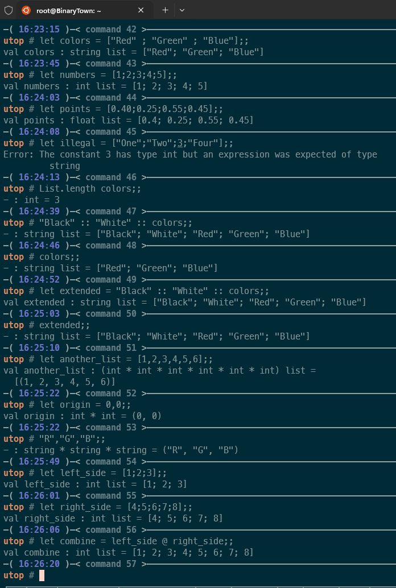

**colors**, **numbers** ve **points** kendi veri türlerinde elemanlar taşıyan birer liste. **illegal** isimli liste ise farklı türden elemanlardan oluşan bir liste yapısı oluşturmak istediğimizde alacağımız hatayı üretiyor. OCaml'ın **List** modülünde bazı yardımcı fonksiyonlar da bulunuyor. Örnek kodlarda listenin uzunluğunu bulmak için **List.length**, liste başına eleman eklemek için **::** operatörü *(constructor operator)* kullanılmakta. Dikkat edelim, orijinal liste değişmiyor! İlaveler sonrası yeni bir liste oluşuyor.

Çalışırken yaptığım hatalardan birisi de liste elemanlarını tanımlarken arada virgül kullanmaktı. Bunu yapınca bir liste yerine tek elemanlı bir tuple listesi oluşmakta. Dolayısıyla **;** ile *,* kullanımına dikkat etmeli. Hatta bir **tuple** tanımlanırken parantez kullanmazsak, virgül ile ayrılmış değerler bir tuple olarak algılanıyor. **@**, yani add operatörünü kullanarak listeleri birleştirmek de mümkün.

Peki bir liste veri yapısında *pattern matching* kullanabilir miyiz? Basit bir örnek üstünden ele alalım.

```ocaml
let first_or_default values =
      match values with
      | first :: the_rest -> first
      | [] -> 0;;
first_or_default [];;
first_or_default [12;0;23;9;14];;
```

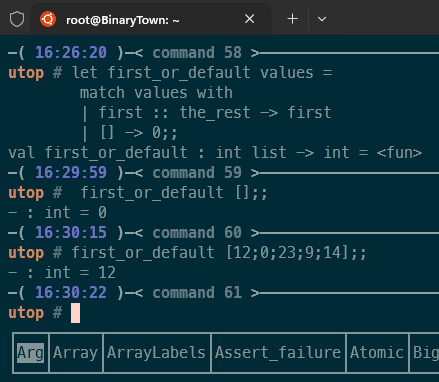

Burada tanımladığımız **first_or_default** isimli fonksiyon **int** türünden bir listenin ilk elemanını döndürüyor ancak **pattern matching** ile uyguladığımız bir koşul var. Boş bir liste verilirse varsayılan olarak 0 değerini, aksine dolu bir liste gelirse ki bunu **first :: the_rest** ifadesi ile eşleştiriyoruz *(ilk eleman ve kalanlar anlamında düşünebiliriz)*  listenin ilk elemanını dönüyor. Yorumlayıcının boş bir liste söz konusu ise 0 döndürülmesinden yola çıkarak fonksiyonun **integer** bir liste ile çalışacağına kanaat getirdiğine dikkat edelim. Dolayısıyla bu fonksiyonu aşağıdaki gibi yazarsak generic bir versiyon da çıkarmış oluruz.

```ocaml
let first_or default values =
      match values with
      | first :: the_rest -> first
      | [] -> default;;
first_or "" [];;
first_or 1 [];;
first_or 0 [12;2;6;9];;
```

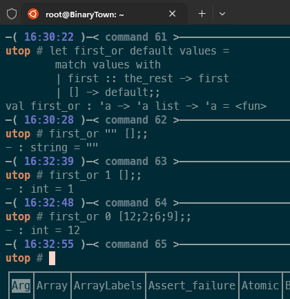

Şimdi bir sayı listesindeki elemanların toplamını hesaplayan hem **pattern matching** içeren hem de **recursive** olan bir fonksiyon yazalım. Eh, bir döngü ile listeyi dolaşmak vardı ama **Real World OCaml** kitabına göre öz yinelemeli fonksiyonlar, fonksiyonel dillerin gerçekten önemli bir parçası. Doğrusu bundan güzel bir sınav sorusu olurmuş, *"Herhangi bir sayı listesindeki elemanların toplamını bulacak bir fonksiyon yazın. Döngü kullanmak yasak, recursive fonksiyonellik şart"* :D

```ocaml
let rec sum_of list =
      match list with
      | [] -> 0
      | head :: tail -> head + sum_of tail;;
sum_of [1;4;4;2;6;7];;
let numbers = [0;2;4;9;-4;-5];;
sum_of numbers;;
```

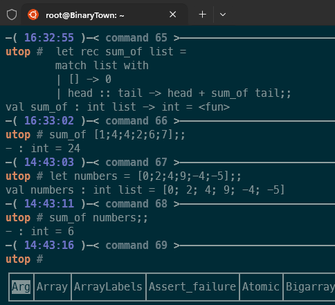

Bunu büyük ihtimalle unutacağım ve bakmadan yazamayacağım ama birkaç önemli noktayı kayıt altına almak isterim. **sum_of** fonksiyonunun kendisini referans ettiğini belirttiğimiz bir yer var, **rec** anahtar kelimesi. Bir fonksiyonun recursive olduğunu belirtiyor. Boş liste veya dolu liste gelmesi ihtimallerine karşı bir **pattern matching** kullanımı da söz konusu. Eğer boş bir liste gelirse toplamın sıfır döneceğini belirtmek aynı zamanda bu fonksiyonu **integer** listelerle çalışacak bir türe dönüştürüyor. İkinci **match** dalında **head** ve **tail** durumlarını ele alıyoruz ve fonksiyonu tekrar çağırarak sayıları birbirlerine ekliyoruz. Yani ilk sayıdan başlarsak 1 + sum_of [4;4;2;6;7] gibi bir dizilim ortaya çıkıyor. İkinci match kırılımı için **tümevarımsal *(inductive)*** yaklaşımın benimsendiğini vurgulayalım. Bu fonksiyonun işleyişine ait aşağıda bir örnekleme yer alıyor.

```text
= 1 + sum_of [4;4;2;6;7]
= 1 + (4 + sum_of [4;2;6;7])
= 1 + (4 + (4 + sum_of [2;6;7]))
= 1 + (4 + (4 + (2 + sum_of [6;7])))
= 1 + (4 + (4 + (2 + (6 + sum_of [7]))))
= 1 + (4 + (4 + (2 + (6 + (7 + sum_of [])))))
= 1 + (4 + (4 + (2 + (6 + (7 + 0)))))
= 1 + (4 + (4 + (2 + (6 + 7))))
= 1 + (4 + (4 + (2 + 13)))
= 1 + (4 + (4 + 15))
= 1 + (4 + 19)
= 1 + 23
= 24
```

Piuvv! :D Parantezleri karıştırmış olabilirim. Kitapta 1;2;3 listesini toplamıştı.

Bugünkü terapide son olarak **Options** veri yapısına bakıyorum. Bir değer vardır veya yoktur sorusuna cevap veren bir veri yapısı. Şahsen **rust** dilinde **Options** türü çok işe yarıyor *(Rust'ı geliştiren Graydon Hoare'un OCaml'den esinlendiği birçok yerde belirtiliyor)* Aşağıdaki kod parçasında en basit kullanım şekli yer alıyor.

```ocaml
let div x y = if y = 0 then None else Some (x/y);;
div 10 0;;
div 10 2;;
```

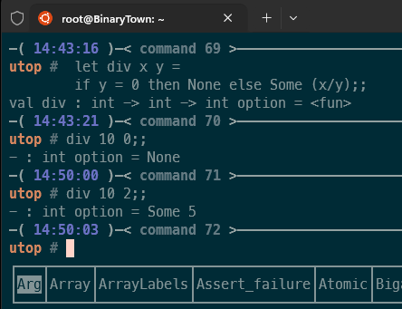

Eğer **y** sıfır ise **None** dönüyor değilse bölme işlemi gerçekleştiriliyor. Dikkat edileceği üzere yorumlayıcı fonksiyonun dönüş türünü **int option** olarak belirledi. Bu son derece normal zira 7 değerinin 0 olup olmadığı kontrol ediliyor. Sıfırın varsayılan olarak **int** olarak kabul edildiği düşünülürse *int option* olarak yorumlanması son derece doğal. Bu arada **None** ve **Some** ifadeleri rastgele isimlendirmeler değil birer **constructor** olarak kabul ediliyor.

### Record Veri Yapısı ve Variant Tipler

Pek tabii var olan türler dışında karma türler de tanımlayabiliriz. Kendi veri yapılarımızı tasarlarken kullanabileceğimiz enstrümanlardan birisi **record** türüdür.

```ocaml
type address = {host:string; port:int; route:string};;

let cust_get ={host = "localhost"; port = 5001; route = "api/v1/customer/get"};;

type service = {name : string; is_active : bool; kind : string; path : address};;

let customer_service = {name = "Get customers"; is_active = true; kind = "REST"; path = cust_get};;
```

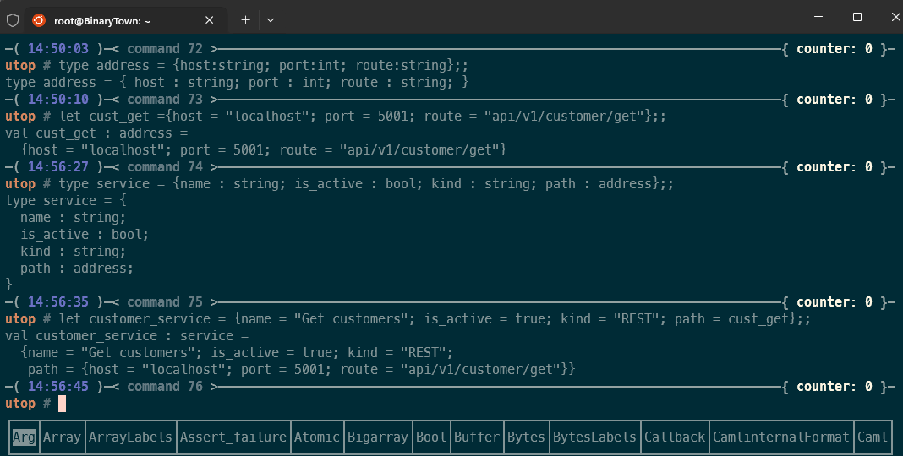

Yukarıdaki kod parçasında iki **record** türü yer alıyor, **address** ve **service**. Dikkat edileceği üzere service **record** yapısındaki path alanı address veri yapısı türünden. cust_get ve customer_service isimli değişkenler ise bu türlera ait nesneleri işaret ediyor. Açıkça belirtmesek de eşitliğin sağ tarafından yapılan atamalar otomatikman cust_get'in bir address türü olmasını sağlıyor. Benzer şekilde customer_service değişkeni de service türünden bir nesne olarak tanımlanıyor. **utop** ekran görüntüsünde olduğu gibi çıktılara mutlaka bakmak lazım. **type inference** mekanizmasının nasıl çalıştığını görmek açısından önemli.

Şimdi birde **variant** tanımlamayı deneyelim. Bu tür ile birden fazla nesneyi *(object)* tek bir tip altında birleştirmek mümkün. Aşağıdaki örnek kod parçası ile anlamaya çalışalım.

```ocaml
type location = { x : float; y : float }
type button = { title: string; position: location }
type label = { title: string; position: location }
type drop_down = { items: string list; position: location; is_enabled: bool }

type component =
  | Button of button
  | Label of label
  | DropDown of drop_down
;;
```

Bu kod parçasında button, label, drop_down gibi farklı türden nesneleri tek bir component türünde birleştirdik. Bu sayede component türünden bir değişken tanımladığımızda söz konusu değişken button, label veya drop_down türlerinden herhangi birini işaret edebilir. Aralarda pipe işareti olduğuna dikkat etmemiz gerekiyor ve hatta `|` sonrası gelen isimlendirmede büyük harfle başlama zorunluluğu var, aksi halde **syntax error** hatası alınıyor. drop_down isimli record türünde bir **string list** kullanılıyor. Dolayısıyla birden fazla **string** öğe barındırabilir. Kitaptaki örnekten de esinlenerek bu **variant** türünü bir fonksiyona parametre olarak geçebiliriz.

```ocaml
let get_item_count (c : component) : int =
  match c with
  | Button _ -> 0
  | Label _ -> 0
  | DropDown d -> List.length d.items
;;

let left_menu = DropDown {
  items = ["Save"; "Load"; "Exit"];
  position = {x = 10.0; y = 20.0};
  is_enabled = true
}
;;

get_item_count left_menu;;
```

Bu fonksiyon component türünden bir parametre alıyor ve bu parametrenin hangi türde olduğunu **pattern matching** ile kontrol ediyor. Eğer button veya label ise 0 döndürüyor, ancak drop_down ise içindeki items listesinin uzunluğunu döndürüyor.

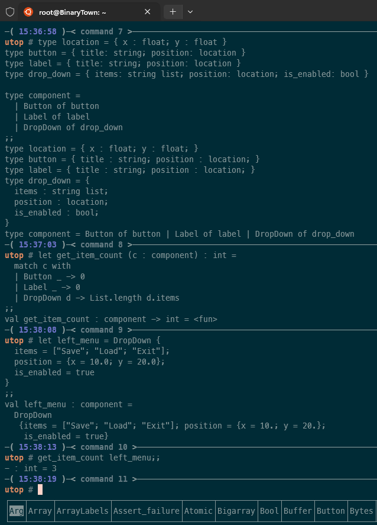

Farklı bir fonksiyon daha yazalım. Örneğin bileşen detaylarını gösteren bir versiyon.

```ocaml
let show_component_details (c : component) : unit =
  match c with
  | Button b -> 
      Printf.printf "Button: %s\n" b.title
  | Label l -> 
      Printf.printf "Label: %s\n" l.title
  | DropDown d ->
      Printf.printf "DropDown containing:\n";
      List.iter (fun item -> Printf.printf " - %s\n" item) d.items
;;

show_component_details left_menu;;
```

Fonksiyonumuz parametre olarak **component** isimli **variant** türünden bir nesne alıyor. Bu nesnenin hangi türde olduğunu **pattern matching** ile kontrol ediyoruz. Eğer button veya label ise başlık bilgisini yazdırıyoruz. Ancak drop_down ise içindeki items listesini dolaşıp her bir öğeyi yazdırıyoruz. **List.iter** fonksiyonu, verilen bir fonksiyonu listenin her bir elemanına uygulamak için kullanılmakta.

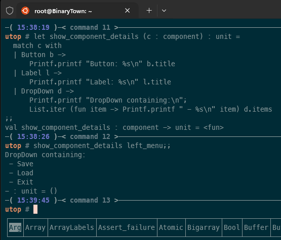

### Mutable Olma Hali

> Varsayılan olarak immutable ama gerekirse mutable. Rust'ın açık bir şekilde benimsediği bir yaklaşım. Varsayılan olarak immutable olmak aslında bir şeylerin yanlışlıkla değiştirilmesini engellemek açısından anlamlı. Diğer yandan imperative yaklaşımın ele alındığı sayaçlar *(counters)* ve durum otomatı *(state machine)* gibi kodlar yazmanın önü de açık.

OCaml'ın **safkan bir fonksiyonel dil** olduğu belirtiliyor. Yani, kodun çalışmasının bir parçası olarak değişkenlerin değerlerini değiştirmek normalde mümkün değil. Programın durumu **immutable** veri yapılarıyla temsil ediliyor. Buna karşın **imperative** programlama paradigmasını da destekliyor. Bir başka deyişle **mutable** veri yapıları da mevcut. Örneğin **Array** veri yapısı bunlardan birisi. Bunun haricinde **record** türünün kendisi **immutable** olsa dahi üyeleri **mutable** olarak tanımlanabilir. Şimdi yine beni zorlayacak yazım stilleriyle bir **array** tanımlayalım ve kullanalım. Hatta sonrasında **mutable** üyeler içeren bir **record** yazalım.

```ocaml
(* float sayılardan oluşan bir array tanımı*)
let points = [| 45.50; 30.25; 60.75; 48.90; 80.; 0.; |];;

(* array operatörlerine erişim *)
Printf.printf "First point: %.2f\n" points.(0);;
Printf.printf "Second point: %.2f\n" points.(1);;

(* Bir array elementini değiştirmek istersek şöyle yapabiliriz *)
points.(0) <- 51.00;;
Printf.printf "Updated first point to: %.2f\n" points.(0);;

(* Array'in tamamını görüntülemek için *)
points;;

(* 
Belki bir döngü yardımıyla array elemanlarını görütülemek isteyebiriz
Hatta döngü içinde pattern match kullanıp dersten geçti, kaldı vs diyebiliriz
*)
for i = 0 to Array.length points - 1 do
  match points.(i) with
  | p when p >= 50.0 -> Printf.printf "Student %d passed with %.2f\n" (i + 1) p
  | p -> Printf.printf "Student %d failed with %.2f\n" (i + 1) p
done;;
```

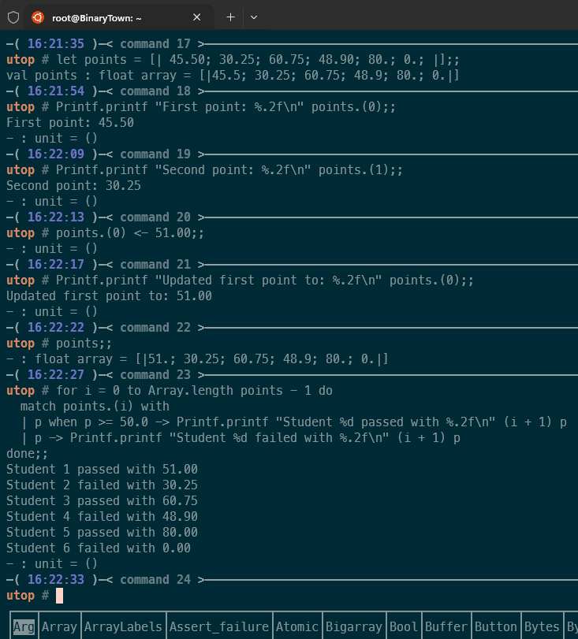

Bu örnekte **points** isimli bir array tanımladık. Array elemanlarına erişmek için **.(index)**, bir array elemanını değiştirmek için ise **<-** operatörünü kullandık. Sonrasında array'in tamamını görüntüledik ve bir döngü yardımıyla her bir elemanı kontrol ederek öğrencinin dersten geçme/kalma durumunu ekrana yazdırdık.

Öyleyse birde **mutable** üyeler içeren bir **record** tanımlayalım. Burada dikkat edilmesi gereken noktalardan birisi de **<-** operatörünün **unit ()** döndürmesidir. Bu, yapılan atama işleminin bir hesaplama *(calculation)* olmadığını aksiyon *(action)* olduğunu belirtir. Yani, points.(0) <- 51.00 ifadesi bir değer döndürmez, sadece **points array**'inin ilk elemanını 51.00 olarak günceller.

```ocaml
(* 
  Varsayılan olarak immutable olan record üyeleri mutable yapılabilir.
  Şöyle anlamlı bir örnek düşünelim. Bir oyuncunun adı genellikle oyun sırasında değiştirilmez
  ancak canı, bulunduğu konu gibi bilgiler anlık olarak değişebilir.
*)

type player = {
  name: string;
  mutable health: int;
  mutable position: (int * int);
};;

let she_ra = { name = "She-Ra"; health = 100; position = (0, 0) };;

(* Bir fonksiyon ile de örneğin oyuncu hasar aldığında health bilgisini güncelleyebiliriz *)
let take_damage player amount = 
  player.health <- player.health - amount;
  Printf.printf "%s took %d damage and now has %d health.\n" player.name amount player.health
;;

take_damage she_ra 30;;

(* Oyuncunun pozisyonunu güncellemek için de benzer şekilde bir fonksiyon yazabiliriz *)
let move_player player new_position =
  player.position <- new_position;
  Printf.printf "%s moved to position (%d, %d).\n" player.name (fst new_position) (snd new_position)
;;

move_player she_ra (5, 10);;
```

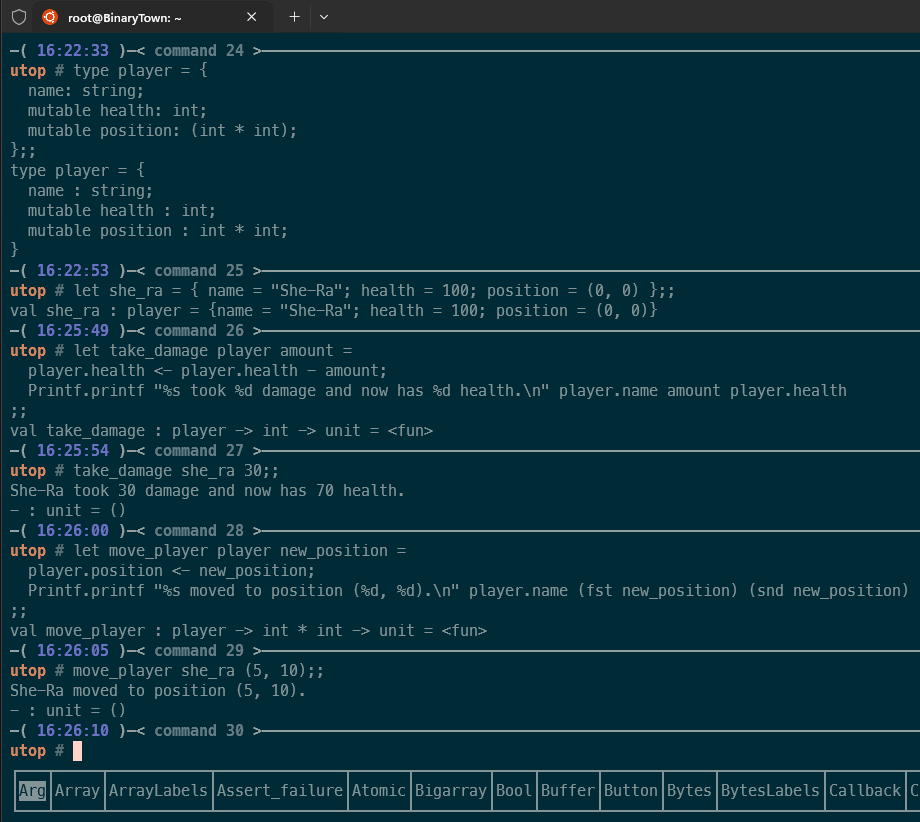

Şimdi burada durup **OCaml** dilinin bu varsayılan **immutable** felsefesini düşünmek lazım. Normalde yukarıdaki gibi bir senaryo varsayılan olarak aşağıdaki gibi ifade edilir.

```ocaml
(* 
  OCaml'ın immutable felsefesini anlamak için bu örneği varsayılan durumda ele alalım
  Aşağıda görüldüğü gibi normal bir record tanımı yaptık.
*)
type player = {
  name: string;
  health: int;
  position: (int * int);
};;

let she_ra = { name = "She-Ra"; health = 100; position = (0, 0) };;

(* take_damage fonksiyonu artık player record'ünün health üyesini değiştiremez.
  Bu yüzden yeni bir player record'ü oluşturarak güncellenmiş bilgileri içeren bir record döndürmemiz gerekir.
  Tabii bu durumda var olan player record' unun bir kopyasını oluşturmuş oluruz.

  Örnekte update_player oluşturulurken health bilgisi güncelleniyor,
  burada with keyword kullandığımıza dikkat edelim. in ise yeni record'ün oluşturulacağı scope'u belirtiyor.
*)
let take_damage player amount = 
  let updated_player = { player with health = player.health - amount } in
  Printf.printf "%s took %d damage and now has %d health.\n" player.name amount updated_player.health;
  updated_player
;;

let she_ra = take_damage she_ra 8;;

(* 
  Bir fonksiyon tanımlamadan değer değiştirmek istersek bu durumda aşağıdaki gibi ilerleyebiliriz. 
  Söz gelimi pozisyonu değiştrelim.
*)
Printf.printf "%s is currently at position (%d, %d).\n" she_ra.name (fst she_ra.position) (snd she_ra.position);;
let she_ra = { she_ra with position = (25, 50) };;

Printf.printf "%s moved to position (%d, %d).\n" she_ra.name (fst she_ra.position) (snd she_ra.position);;
```

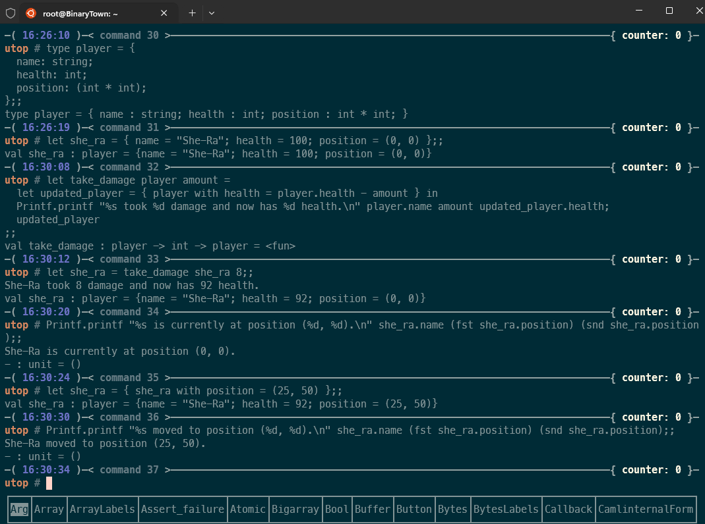

Burada **fst** ve **snd** ifadeleri aslında birer fonksiyon. Bir tuple'ın ilk ve ikinci elemanına erişmek için kullanılırlar. Yani, fst new_position ifadesi new_position adlı tuple'ın ilk elemanını döndürürken, snd new_position ifadesi ikinci elemanını döndürmektedir. Yukarıdaki kod parçasında gerekli açıklamalar yer alıyor. Belki de hangisini ne zaman seçmek gerekir üzerine düşünmek lazım. Ne zaman **immutable** yerine **mutable** tercih edelim ya da tam tersi?

- Varsayılan olarak **immutable** olmak, **concurrency** ve karmaşık mantık içeren kodlarda hataların önüne geçmek açısından avantajlı olabilir. Zira değişken değerlerinin beklenmedik şekilde değişmesi engellenmiş olur. Söz gelimi buradaki player'ın immutable olan versiyonunu bir fonksiyona geçtiğimizde, onun ilgili fonksiyon içinde değişmeyeceğinden emin oluruz.
- **Mutable** veri yapıları ise veriyi kopyalamadan değiştirme imkanı sağlar ve bazı durumlarda, örneğin state değiştirmek veya gerçek zamanlı güncellemeler yapmak istediğimizde daha performanslı olabilir. Ancak mutable veri yapılarını kullanırken dikkatli olmak gerekir, çünkü yanlışlıkla veriyi değiştirmek veya beklenmedik yan etkiler oluşturmak mümkündür. Bu konuda sanıyorum en sık verilen örnek sayaç mekanizması. **OCaml** ile basit bir **counter** tasarlayalım.

```ocaml
(*
  Bir sayaç gerçek zamanlı güncellemeyi gerektirir. Bu nedenle immutable olarak kullanmak,
  sürekli yeni bir kopya oluşturmaya neden olabilir ve bu da performans açısından iyi değildir.
  Dolayısıyla OCaml gibi varsayılan olarak immutability felsefesini benimsemiş diller için,
  sayaç mekanizması güzel bir mutable olma örneğidir.
*)
type counter = {
  mutable count: int;
};;

let tick_counter = { count = 0 };;

let increment (crt: counter) =
  crt.count <- crt.count + 1
;;

increment tick_counter;;
increment tick_counter;;
increment tick_counter;;

Printf.printf "Current count: %d\n" tick_counter.count;;
```

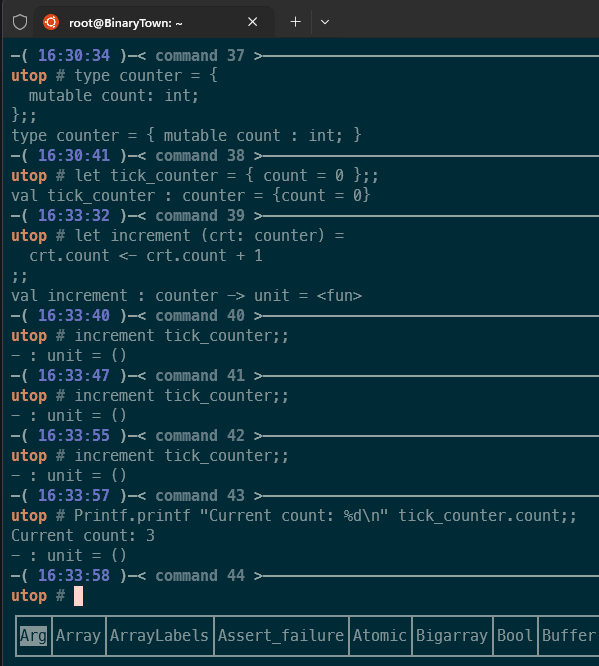

### Refs

Tekil bir mutable değişken oluşturmak için **ref** enstrümanı da kullanılabilir. **ref** esasında standart kütüphanede tanımlanmış bir tip ve hatta bir **record** türü. İçinde **contents** isimli bir alan içeriyor. Hatta stdlib.ml dosyasına bakarsak aşağıdaki gibi tanımlandığını görürüz.

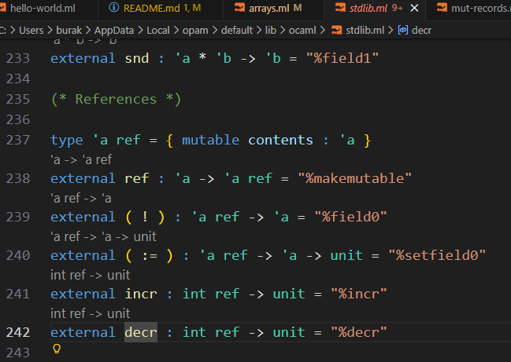

**!** ve **:=** şeklinde tanımlanmış fonksiyonlar dikkatinizi çekmiştir. **!** operatörü bir ref'in içindeki değere erişmek için kullanılırken, **:=** operatörü ise bir ref'in içindeki değeri değiştirmek için kullanılır. Yine **incr** ve **decr** fonksiyonları yardımıyla değer artırma ve azaltma işlemleri de yapılabilir. **OCaml** komut satırından bir deneme yapabiliriz.

```ocaml
let counter = ref 0;;
!counter;;
counter := !counter + 1;;
!counter;;
counter := !counter + 1;;
!counter;;
counter := !counter + 1;;
!counter;;
```

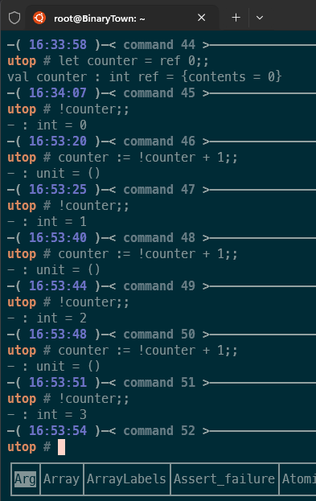

Bu arada istersek **ref** türünü kendimiz de dizayn edebiliriz. Hatta kitap bunu gayet güzel bir şekilde örnekliyor. Bir deneyelim.

```ocaml
(*
  İstersek buradaki ref record yapısını kendimiz de yapabiliriz.
  Burada polimorfik bir record yapısı tanımlayarak herhangi bir türdeki değeri mutable olarak tutabiliriz.

  'a ifadesi, OCaml'da polimorfik tür parametresini temsil eder. 
  Bu, mutable_ref türünün herhangi bir türdeki değeri tutabileceği anlamına gelir. 
  x ile başlatılan mutable_ref fonksiyonu, verilen değeri mutable_ref türünde bir record olarak döndürür.
*)
type 'a mutable_ref = {
  mutable value: 'a;
};;
let mutable_ref x = { value = x };;
let get r = r.value;;
let set r x = r.value <- x;;
let incr r = r.value <- r.value + 1;;
let decr r = r.value <- r.value - 1;;

(* Deneyelim bakalım *)
let my_counter = mutable_ref 0;;
Printf.printf "My Counter: %d\n" (get my_counter);;
incr my_counter;;
Printf.printf "My Counter: %d\n" (get my_counter);;
set my_counter 10;;
Printf.printf "My Counter: %d\n" (get my_counter);;
decr my_counter;;
Printf.printf "My Counter: %d\n" (get my_counter);;
```

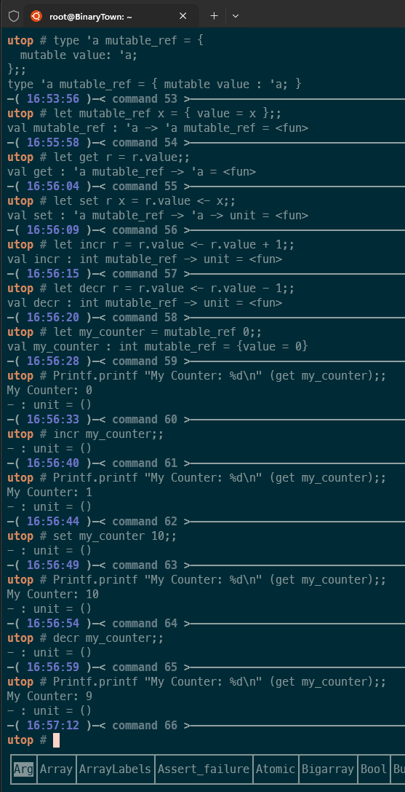

**ref** türü iterasyonlarda değiştirilebilir *(mutable)* state tutarken de kullanışlı olabilir. Örneğin bir listedeki elemanların ortalamasını hesaplamak için aşağıdaki gibi bir fonksiyon geliştirelim.

```ocaml
let avrage lst =
  let sum = ref 0 in
  let count = ref 0 in
  List.iter (fun x -> sum := !sum + x; count := !count + 1) lst;
  if !count = 0 then None else Some (!sum / !count)

let numbers = [1; 2; 3; 4; 5; 10;];;
Printf.printf "Average: %d\n" (match avrage numbers with Some avg -> avg | None -> 0);;
```

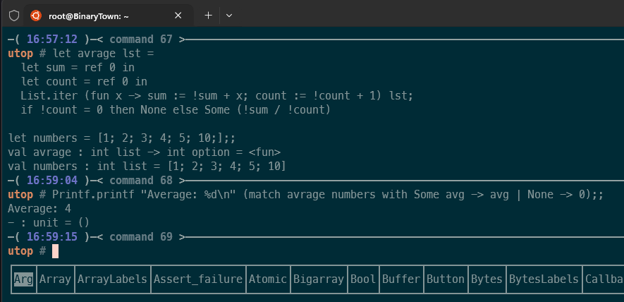

**average** isimli fonksiyon içerisinde yer alan **sum** ve **count** değişkenleri **mutable** olarak tanımlanmıştır ve **List.iter** fonksiyonu kullanılarak listenin her bir elemanı üzerinde işlem yaparken bu değişkenlerin değerleri güncellenmektedir. Tabii **iter** fonksiyonuna verilen anonim fonksiyon içerisinde **!** operatörünü kullanarak ref'lerin içindeki değerlere erişiyoruz ve **:=** operatörünü kullanarak bu değerleri güncelliyoruz. Birde **in** operatörü ile karşılaştık tabii ki. Bu operatör **sum** ve **count** değişkenlerinin bulundukları fonksiyon bloğunda geçerli olduğunu belirtmek için kullanılmakta. Yani **scope** belirlemek için kullanılır. **in** kullanımının farkını anlamak için özellikle Utop ekranında aşağıdaki gibi bir deneme yapalım.

```ocaml
let value = 12;;
let point = 90 in point + 10;;
value;;
point;;
(*
  Line 1, characters 0-5:
  1 | point;;
      ^^^^^
  Error: Unbound value point
*)
```

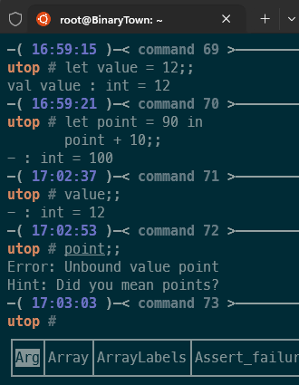

**value** isimli değişken global scope'ta tanımlanmış ve bu nedenle herhangi bir yerden erişilebilir durumda. Ancak **point** isimli değişken **in** operatörünün kullanıldığı fonksiyon bloğu içerisinde tanımlanmış ve bu nedenle sadece o blok içerisinde geçerli. Dolayısıyla **point** değişkenine global scope'tan erişmeye çalıştığımızda **Unbound value** hatası alıyoruz.

### Döngüsüz Olmaz Tabii *(for, while loops)*

En basit örneklerle başlayalım. Bir sayaç fonksiyonunu hem **for** hem de **while** döngüsü kullanarak yazalım.

```ocaml
let count_for n =
  for i = 1 to n do
    Printf.printf "%d," i
  done;
  Printf.printf "\n"

let count_while n =
  let i = ref 1 in
  while !i <= n do
    Printf.printf "%d," !i;
    i := !i + 1
  done;
  Printf.printf "\n"
;;

count_for 5;;
count_while 10;;
```

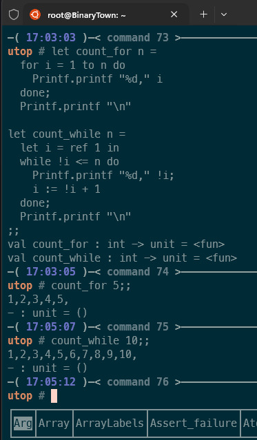

Şimdi örneklerimizi biraz daha eğlenceli hale getirelim. Örneğin, tamsayılardan oluşan bir listeyi **Random** modülünden de yararlanarak belli aralıktaki rastgele sayılarla dolduralım.

```ocaml
let average arr = 
  let sum = ref 0 in
  for i = 0 to Array.length arr - 1 do
    sum := !sum + arr.(i)
  done;
  float_of_int !sum /. float_of_int (Array.length arr)

let arr = generate_random_list 10 |> Array.of_list;;

Printf.printf "Random numbers (while): %s\nAverage: %f\n" 
  (String.concat "; " (List.map string_of_int (Array.to_list arr))) 
  (average arr);;
```

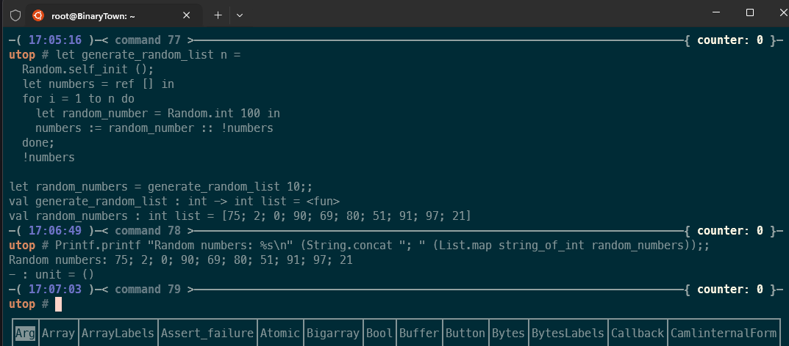

**generate_random_list** fonksiyonu n değerine göre bir liste döndürmekte. Bu listenin elemanları 0 ile 99 arasındaki rastgele sayılarla dolduruluyor. Örnekte **Random** isimli bir modül kullanıyoruz *(Galiba her dilde bu modül mevcut :D)* Dikkat edilmesi gereken noktalardan birisi **self_init()** çağrısı. Bunu yapmadığımız takdirde her seferinde aynı rastgele sayıların üretildiğini görürüz. Üretilen rastgele sayılar **::** operatörü yardımıyla numbers isimli listeye ekleniyor. Sonrasında **!numbers** ifadesiyle de oluşturulan liste döndürülüyor. Kodun son satırında ise bu listeyi ekrana bastırmak için **String.concat** ve **List.map** fonksiyonlarından yararlanıyoruz. **List.map** fonksiyonu, verilen bir fonksiyonu listenin her bir elemanına uygulayarak yeni bir liste oluşturur. Bu örnekte, **string_of_int** fonksiyonunu kullanarak her bir tamsayıyı string'e dönüştürüyoruz. Ardından **String.concat** fonksiyonu ile bu string'leri "; " ile birleştirerek tek bir string elde ediyoruz ve bunu ekrana yazdırıyoruz. Aynı fonksiyonu birde **while** döngüsü kullanarak yazalım.

```ocaml
let generate_random_list_while n =
  Random.self_init ();
  let numbers = ref [] in
  let i = ref 1 in
  while !i <= n do
    let random_number = Random.int 100 in
    numbers := random_number :: !numbers;
    i := !i + 1
  done;
  !numbers

let random_numbers_while = generate_random_list_while 10;;

Printf.printf "Random numbers (while): %s\n" (String.concat "; " (List.map string_of_int random_numbers_while));;
```

Bu fonksiyonda aynı şekilde n değerine göre bir liste döndürmekte ancak bu kez **while** döngüsünü kullandık. Döngü içerisinde i değişkeni 1'den başlayarak n'ye kadar artırılır ve her iterasyonda rastgele bir sayı üretilerek numbers listesine eklenir. Her iki fonksiyonun çalışma zamanına ait bir çıktıyı da ekleyelim.

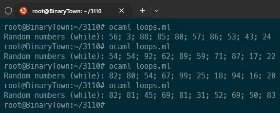

Örneklerimize devam edelim. Parametre olarak gelen **Array** içindeki sayıların ortalamasını bulup döndüren bir fonksiyonu hem **for** hem de **while** döngüsü kullanarak yazalım.

```ocaml
let average arr = 
  let sum = ref 0 in
  for i = 0 to Array.length arr - 1 do
    sum := !sum + arr.(i)
  done;
  float_of_int !sum /. float_of_int (Array.length arr)

let arr = generate_random_list 10 |> Array.of_list;;
Printf.printf "Average: %f\n" (average arr);;
```

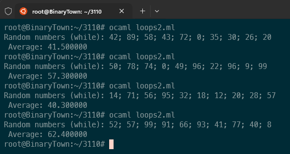

**average** isimli fonksiyon, **arr** isimli bir parametre almakta. Tabii bunun bir **Array** olduğunu varsayıyoruz. **sum** isimli değişkeni **mutable** olarak tanımladık zira bir toplam değerine ihtiyacımız var. Sonrasında bir **for** döngüsü yardımıyla dizi elemanlarını arka arkaya toplatıyoruz. **!** operatörü ile sum dizisi içindeki değere erişiyoruz ve **:=** operatörünü kullanarak bu değeri güncelliyoruz. Döngü tamamlandıktan sonra toplam değeri dizi uzunluğuna bölerek ortalamayı hesaplıyoruz. Dikkat edelim, bölme işlemi sırasında tam sayı bölmesi yapMAmak için hem toplamı hem de dizi uzunluğunu **float_of_int** fonksiyonu ile **float** türüne dönüştürüyoruz. Sonrasında bu fonksiyonu kullanarak bir dizi oluşturup ortalamasını ekrana yazdırıyoruz.

Peki bu fonksiyona alakasız bir veri türü göndersek ne olur, örneğin metinsel bir ifade...

```ocaml
let himm = "Bu örneklerde for ve while döngülerini kullanarak listeler ve diziler üzerinde işlemler yaptık.";;
let avg = average himm;;
```

VS Code arabiriminden baktığımızda da çalışma zamanında denediğimizde de bir hata ile karşılaşırız.

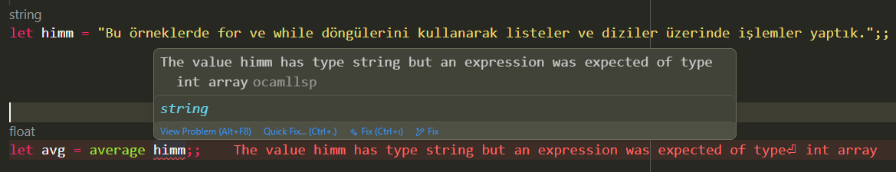

Sıradaki fonksiyonumuz iki boyutlu bir matris üretiyor. Herbir elemanı 0 veya 1 olabilen bir matris. Basit bir oyun sahasının iki boyutlu görünümünde duvar veya yol kararını vermeyi kolaylaştırabilecek çok basit bir örnek.

```ocaml
let generate_matrix row_count col_count =
  Random.self_init ();
  let matrix = Array.make_matrix row_count col_count 0 in
  for i = 0 to row_count - 1 do
    for j = 0 to col_count - 1 do
      matrix.(i).(j) <- Random.int 2
    done;
  done;
  matrix

let matrix = generate_matrix 5 8;;
Printf.printf "Generated Matrix:\n";
Array.iter (fun row ->
  Array.iter (fun value -> Printf.printf "%d " value) row;
  Printf.printf "\n"
) matrix;;
```

Burada yardımcı birkaç fonksiyon da kullandık. Örneğin iki boyutlu bir matris dizisini oluşturmak için **make_matrix** fonksiyonuna başvurduk. İki boyutlu dizinin elemanlarını satır sütun bazında dolaşmak içinse klasik iç içe **for** döngüsü kullandık. Doğrudan dizinin elemanların atama işlemi yapılacağından **<-** operatörü ile 0 ile 1 şeklinde üretilen rastgele sayıları atadır. **Random.int** fonksiyonuna 2 değerini verdiğimizde sadece 0 veya 1 değerleri üretilebilir. Fonksiyon çıktısı olan matrisi ekrana yazdırmak için yine içiçe for döngüsü kullanabiliriz ama **fonksiyonel** bir yaklaşımla ilerlemek de oldukça şık. Nitekim **Array** modülünde yer alan **iter** fonksiyonu ile dizinin her bir elemanına uygulanacak bir fonksiyon çalıştırabiliriz. Dolayısıyla dış iterasyon, row'u parametre olarak alan ve dolayısıyla kolonları dolaşmayı sağlayacan anonim bir fonksiyon kullanıyor. İç iterasyon ise value'yu parametre olarak alan ve bu değeri ekrana yazdıran bir anonim fonksiyon. Her satırın sonunda ise yeni bir satır başlatmak için **Printf.printf "\n"** ifadesi yer almakta. Aşağıda çalışma zamanına ait örnek bir görüntü yer alıyor.

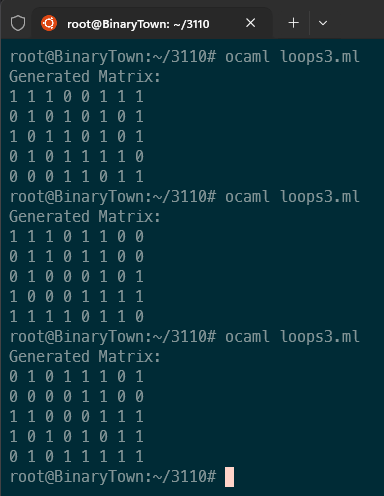

### Derleyerek Çalıştırmak

**Real World OCaml** kitabı bir sonraki bölüme geçmeden önce **A Complete Program** başlığında basit bir program örneği anlatıyor. Bu örnekte **ocaml** kodunun derlenerek çalıştırılması söz konusu. Derleme işlemi için **dune** *(Gezegen olan değil :D)* aracını kullanıyor. Burada temel amaç tek başına çalıştırılabilir *(standlone)* bir program oluşturmak. Öncelikle kodlarımızı oluşturalım. Bu amaçla **standalone** isimli bir klasör oluşturdum ve içerisine **rand_10.ml** isimli bir dosya ekledim. Kolaya kaçarak daha önceden ele aldığımız bir fonksiyonu değerlendirebiliriz. Rastgele sayılalardan oluşan 10 elemanlı bir liste oluşturuyoruz.

```ocaml
let generate_random_list n =
  Random.self_init ();
  let numbers = ref [] in
  for _ = 1 to n do
    let random_number = Random.int 100 in
    numbers := random_number :: !numbers
  done;
  !numbers

let () = 
  let random_numbers = generate_random_list 10 in
  Printf.printf "Random numbers: %s\n" (String.concat "; " (List.map string_of_int random_numbers))
```

Tabii program kodunda dikkat etmemiz gereken şeyler de var. Öncelikle artık **;;** operaötrünü kullanmadığımıza dikkat edelim. Diğer yandan bir de **let () =** ifadesi var. Bunu programın giriş noktası olarak düşünebiliriz. Yani, program çalıştığında ilk olarak bu kısım çalışacaktır.

Derleme işleminden önce bu klasörde oluşturmamız gereken iki dosya daha var; **dune** ve **dune-project**. İkisinin de uzantısı yoktur ve derlenecek programla ilgili bir takım konfigürasyon bilgilerini içerirler *(Tahmin edileceği üzere)*. **dune** içeriğini şöyle oluşturabiliriz.

```dune
(executable
 (name rand_10))
```

Kod dosyasının adı **rand_10.ml** olduğu için name kısmına da rand_10 yazdık. **dune-project** dosyasının içeriği ise oldukça basit.

```dune-project
(lang dune 3.0)
```

Bu dosya ile dune aracının hangi sürümünün kullanılacağını belirtiyoruz. Bu adımlardan sonra kodu derleyip çalıştırabiliriz. Normalde sadece **dune build** komutu yeterli olur ancak derleme sırasındaki detayları da görmek istersek **verbose** argümanını kullanabiliriz. Programı çalıştırmak için yine **dune** aracından yararlanıyoruz.

```bash
# Derleme işlemi ve detaylar
dune build --display=verbose
# Programın çalıştırılması
dune exec ./rand_10.exe
```

ve işte çalışma zamanı çıktılarımız.

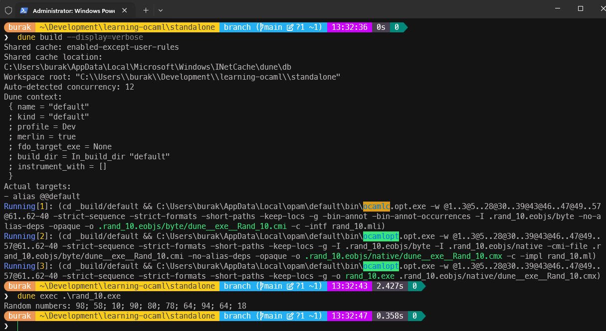

Örneği **ubuntu** platformunda da benzer şekilde derleyebiliriz. Ben **WSL** üzerinden denedim ve aşağıdaki gibi bir çıktı aldım.

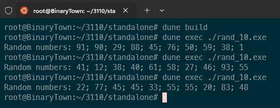

### Alcotest ile Birim Test Yazmak

**OCaml** kodlarını test etmek için birkaç yöntem var. Bunlardan birisi () ile oluşturulan program giriş noktasında klasik terminal çıktıları ile ilerlmek. Ancak birim test *(unit test)* yazmak elbetteki daha profesyonel bir yaklaşım ama daha da önemlisi bir standart. Bu amaçla **dune** ile entegre çalışabilen **Alcotest** isimli bir kütüphane bulunuyor. Öncelikle bu aracı **opam** ile sisteme yüklemek gerekiyor *(Windows veya Linux farketmez)*.

```bash
opam install alcotest
```

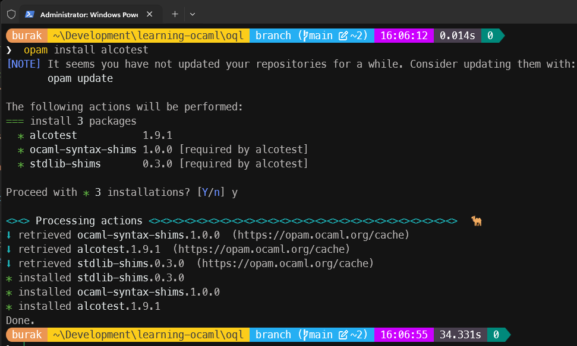

Evet yanlış görmüyorsunuz, terminalde sevimli bir deve emojisi var :D

Genel yaklaşım **library** haline getirilmiş kod dosyaları için **test** kelimesi ile başlayan **ocaml** dosyaları oluşturmak. Örneğin testing isimli bir klasör içerisinde **math.ml** isimli bir modül oluşturduğumuzu, bu modülü bir kütüphane olarak tasarlayıp birim testlerini yazmak istediğimizi düşünelim. Örnek olarak math modülünde aşağıdaki iki basit fonksiyona yer verebiliriz.

```ocaml
(* Faktöriyel hesaplama fonksiyonu *)
let rec factorial n =
  if n < 0 then failwith "Negative input not allowed for factorial"
  else if n = 0 then 1
  else n * factorial (n - 1)

(* Üs alma fonksiyonu *)
let rec power base exp =
  if exp < 0 then failwith "Negative exponent not allowed"
  else if exp = 0 then 1
  else base * power base (exp - 1)
```

Öncelikle bu kütüphanenin bir **library** olarak ele alınması lazım ve ayrıca test dosyalarının da bu kütüphaneyi kullanabilmesi için yapılandırılması gerekiyor. Bu nedenle **dune** dosyasının içeriğini aşağıdaki gibi hazırlamalıyız. Burada math modülünü bir kütüphane olarak tanımlıyoruz. **modules** ile başlayan kısımlar kütüphaneye dahil edilecek modülleri de belirtmekte. Ayrıca **Alcotest** kütüphanesini test kısmında kullanmak üzere **libraries** kısmında bildiriyoruz.

```dune
(library
 (name math)
 (modules math))

(test
 (name test_math)
 (modules test_math)
 (libraries math alcotest))
```

Şimdi de birim testleri içeren **test_math.ml** dosyasını oluşturalım. Burada olası tüm durumları test etmekte yarar var elbette ki ancak ben örnek olması açısında birkaç tanesine yer verdim.

```ocaml
let test_factorial () =
  let value = 5 in
  let expected = 120 in
  let result = Math.factorial value in
  Alcotest.(check int) "factorial of 5" expected result

let test_power () =
  let base = 2 in
  let exp = 3 in
  let expected = 8 in
  let result = Math.power base exp in
  Alcotest.(check int) "power of 2^3" expected result

let test_factorial_negative () =
  let value = -1 in
  Alcotest.check_raises "factorial of negative number" (Failure "Negative input not allowed for factorial")
    (fun () -> ignore (Math.factorial value))

let () =
  let open Alcotest in
  run "Math Tests" [
    "Math Tests", [
       test_case "factorial of 5" `Quick test_factorial;
       test_case "power of 2^3" `Quick test_power;
       test_case "factorial of negative number" `Quick test_factorial_negative;   
    ];
  ];
```

Testleri çalıştırmak için tek yapmamız gereken aşağıdaki terminal komutunu işletmek.

```bash
dune runtest
```

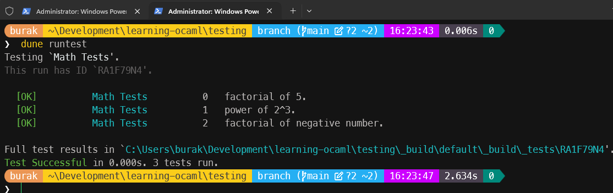

İşte bu da **Ubuntu** çıktısı.

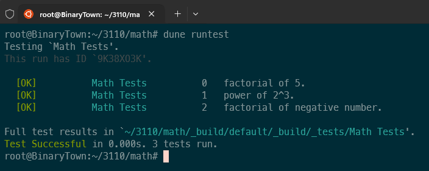

Burada dikkate değer bir durum daha var. Dune, **Incremental Build** ve **caching** mekanizmaları sayesinde sadece değişen dosyaları derleyerek testleri çalıştırır. Dolayısıyla kod tabanında değişiklik olmadığında testler tekrardan çalıştırılmaz. Yani kodun aynı olması testlerin de aynı kalacağı anlamaına gelir ki bu durumda kaynakları boşa israf etmenin de bir alemi yoktur. Burada **dune** kod dosyalarının imzalarını takip ederek bir karara varır. Ancak yinede testleri koşmaya zorlayabiliriz. Bunun için **--force** argümanını kullanmak yeterlidir.

```bash
dune runtest --force
# veya
dune runtest -f
```

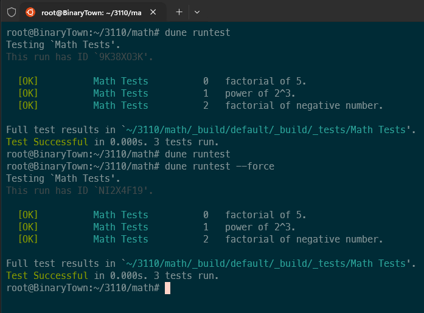

## Biraz da Felsefe

En zor kısım burası. Şöyle bir soru soralım. Neden bazı diller Method Overloading kabiliyeti sunarken bazıları sunmuyor? Yazının bundan sonraki kısmında bu soruya cevap aramayacağız ama gerçekten dilin genleri ve felsefesi ile alakalı konuları kavramaya çalışacağız. Tipler ile başlayalım.

### Hata Yapmayı İmkansız Kılan Tip Desteği *(Type Safety değil Type Expressiveness)*

Verinin alabileceği tüm durumlar ilişik olduğu tip tarafından tanımlanır. Çok klasik bir örnek üzerinden ilerleyelim *(Rust tarafında da kullandığım bir teori ki OCAML'dan geliyormuş :D )*

```ocaml
type payment_type =
  | Cash
  | CreditCard of string * float
  | Crypto of string * bool (*Vault adresi ile ağ onayını tutar*)

let process_payment pay_t =
  match pay_t with
  | Cash -> "Processing cash payment"
  | CreditCard (number, amount) -> Printf.sprintf "Processing credit card payment of %.2f for card %s" amount number
  | Crypto (address, confirmed) ->
      if confirmed then
        Printf.sprintf "Processing crypto payment to address %s" address
      else
        Printf.sprintf "Crypto payment to address %s is pending confirmation" address

let bills_payment = CreditCard ("1234-5678-9012-3456", 150.00);;
let () = 
  process_payment bills_payment
  |> print_endline
```

Önce çalışma zamanına bir bakalım.

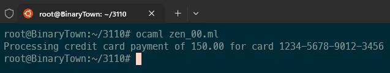

**payment_type** içerisinde kullandığımız CreditCard tipini ele alalım. Kredi kartından bahsedebilmemiz için **string** ve **float** türünde iki bilgiye daha ihtiyacımız vardır. Bir başka deyişle CreditCard sadece bir etiket değil aynı zamanda bu iki bilgiyi de içeren bir yapıdır. Dolayısıyla CreditCard'ı kullanarak bir ödeme işlemi gerçekleştirebilmek için bu iki bilgiyi de sağlamamız gerekir. Sadece böyle bir durumda o veriye erişebiliriz. Bir başka mesele de **pattern match** kullanımıdır. Örneğin herhangi bir varyantı yazmazsak derleyici kızacaktır.

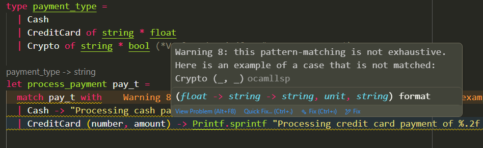

Bir başka deyişle derleyici tasarımımızın bir ortağı gibi hareket eder. Bir varyantı unutmamıza izin vermez. **Rust** dili açısından bakarsak bu yapının bence çok daha şık bir şekli olan **enum** yapısı var. Üstelik Options/Result gibi türler de bu felsefeyi *(anlatabildim mi veya anlayabildim mi işte bütün mesele bu :D)* çok güzel bir şekilde ortaya koyuyor. O zaman mottomuzu söylüyoruz; Tip güvenliği değil tip ifade gücü *(type expressiveness)*.

### Olabildiğince Fonksiyonel

OCaml mümkün olduğunca fonksiyonel olmayı hedefler. Yani her şeyi immutable yazmayı önerir. Lakin performans veya mantık gerektiren şeyler söz konusuysa imperative araçları da emrimize amade eder. Bu noktada **Haskell** gibi dillerden önemli ölçüde ayrıldığı söylenir ki tartışmaya açıktır *(Neden, çünkü Haskell ile hiç tecrübem yok)* Örnek kodlarda ele aldık ama sayaç artırıcı meselesini tekrar masaya yatırabiliriz. Aşağıdaki kod parçasını ele alalım.

```ocaml
(*Saf fonksiyonel yaklaşım*)
let rec sum list = function 
  | [] -> list 
  | x :: xs -> sum (list + x) xs

(* Pragmatik yaklaşım *)
let incrementer () =
  let count = ref 0 in
  fun () -> 
    count := !count + 1;
    !count

let () =
  let inc = incrementer () in
  print_endline (string_of_int (inc ()));
  print_endline (string_of_int (inc ()));
  print_endline (string_of_int (inc ()));
```

İlk önce çalışma zamanını bir değerlendirelim.

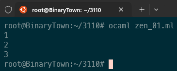

**sum** için tam bir fonksiyonel yaklaşımın söz konusu olduğunu söyleyebiliriz. Hatta tam anlamıyla bir matematiksel bir zerafet sunar. Zira **mutable** bir state yoktur, recursive çalışan fonksiyon her çağrıda yeni bir değer döndürür ve bunlar arka arkaya toplanır. **incrementer** fonksiyonunda kullanılan **ref** keyword bir referans kutusu oluşturur ve **:=** operatörü ile bu kutunun içindeki değeri değiştirebiliriz. Bir başka deyişle bu fonksiyon state değiştiren bir fonksiyondur ve bu nedenle fonksiyonel değil, pragmatik bir yaklaşım sergiler.

Aslında buradaki felsefeyi şöyle düşünebiliriz. Bazı senaryolarda her şeyin saf bir fonksiyon ile yazılması mümkün değildir. Örneğin, milyonlarca finansal işlemin yapıldığı gerçek zamanlı bir uygulamada *(Bence tam bu noktada [Jane Street'in hikayesine](https://ocaml.org/success-stories/large-scale-trading-system) bakılabilir)* veya çok oyunculu bir oyunda mutable state'lere ihtiyaç duyar ve hatta performans ararız. **OCaml** böyle durumlar içinde hazırlıklıdır ve sağladığı mutable araçları kullanarak pragmatik bir şekilde ilerleyebiliriz. Ancak mümkün olduğunca fonksiyonel bir yaklaşım benimsemek kodun daha temiz, anlaşılır ve hatasız olmasına da yardımcı olabilir. Bu nedenle OCaml, fonksiyonel programlama paradigmalarını teşvik ederken aynı zamanda pragmatik ihtiyaçlara da cevap verebilecek esneklikte tasarlanmıştır. **Rust** açısından bakarsak gerçekten de benzer bir felsefeye sahiptir. Her şey varsayılan olarak immutable'dır ve mutable olması gerekiyorsa bu açıkça belirtilmelidir. Ancak Rust'ın sahip olduğu ownership ve borrowing mekanizmaları sayesinde mutable state'ler üzerinde daha sıkı kontrol sağlanır ve bu da güvenli bir şekilde mutable state'ler kullanmamıza olanak tanır ki bu Rust'ı çekici kılan bir başka şeydir.

Konuyu pekiştirmek adına bir başka örneğe bakalım.

```ocaml
let big_data = [|10.4; 20.5; 30.6; 1.0; 3.14 |]

let scale_data factor data =
  for i = 0 to Array.length data - 1 do
    data.(i) <- data.(i) *. factor
  done

let () =
  print_endline "Original data:";
  Array.iter (Printf.printf "%.2f ") big_data;
  print_endline "\nScaling data by a factor of 2.0...";
  scale_data 2.0 big_data;
  print_endline "Scaled data:";
  Array.iter (Printf.printf "%.2f ") big_data;
  print_endline ""
```

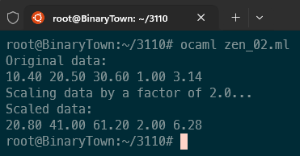

Tabii bu çok küçük bir veri kümesini ele alıyor. Elimizde milyon elamanlı bir veride olabilirdi. Vektörel sayıların olduğu bir dizi mesela. Tek bir değeri güncellemek gerekiyorsa bile diziyi kopyalamak fonksiyonel yaklaşım açısından çok maliyetlidir. Dolayısıyla dizinin elemanını olduğu yerde değiştirmek gerekir. Yukarıdaki kod parçasında **OCaml** bunu nasıl sağlıyoru bir kere daha görmekteyiz. **OCaml**, Array ve Bytes gibi yapıları doğrudan **mutable** olarak tasarlamıştır. **<-** operatörü tam anlamıyla emirsel *(imperative)* bir şekilde çalışır ve dizinin elemanlarını doğrudan değiştirmemize olanak tanır. Yani yerinde veriyi değiştirmemiz mümkündür.

Buradan şu sonuca varabiliriz; Belkide yazacağımız algoritma imperative yaklaşım gerekleri ile daha hızlı çalışıyordur. **OCaml** buna destek verir. Dolayısıyla elimizde yüksek seviyeli dillerin zarifliğine sahip *(her ne kadar sentaksı zorlayıcı olsa da kavramsal olarak öyle)* ama gerektiğinde düşük seviyeli dillerin sunduğu bellek performansına yakın destek veren bir programlama dili var ve **Rust** bence bu özellikleri bir üst noktaya taşıyıp memory de gerçekten güvenli kalabilmenin yolunu da açmış durumda.

### Tony Hoare Anısına

Yazı yazmamdan kısa bir süre önce aramızdan ayrılan, bilgisayar bilimlerinin efsane ismi **Tony Hoare**' ın milyar dolarlık hata olarak da isimlendirdiği **Null Pointer Exception**, programlama dillerinde sıkça karşılaşılan ve ciddi sorunlara yol açabilen bir durumu anlatır. Uğraştığımız pekçok programlama dilinde **null** diye bir kavram var. Kısaca, bir değişkenin değeri yoksa ona null atayabiliriz şeklinde ifade etsek yeridir. Diğer yandan bu durum kodu yazarken bir null kontrolü yapmamızı da gerektirir. *(null değer taşıyabilen bir referansın kullanıldığı her yerde null olup olmadığını kontrol ederek hareket etmek)*. **OCaml** bu konuya şöyle bir felsefe ile yaklaşıyor; **"Eğer bir hata oluşacaksa çalışma zamanında değil derleme zamanında olmalıdır"**. Hımmm...Yani... O zaman null değer yoktur diyebiliriz. Evet, gerçekten de null diye bir kavram **OCaml** dilinde yok. Bunun yerine programcıya sunulan bir seçenek var; **Option**...

Şöyle bir senaryo üzerinden ilerleyelim. Bir identity değerine göre kullanıcı aradığımızı varsayalım. Bunu şöyle yorumlamalıyız; "Kullanıcı ya vardır ya da yoktur"

```ocaml
(*  Aboneleri bir Record tipi olarak tanımladık *)
type subscriber ={
  id:int;
  name:string;
  email:string;
}

(* 
  Liste türünden hayali bir veritabanı ya da mock liste.
*)
let database = [
  {id=1001; name="John Doe"; email="john.doe@azon.com"};
  {id=1002; name="Jane Doe"; email="jane.doe@azon.com"};
  {id=1003; name="Mario"; email="mario@azon.com"};
]

(*
  Abone ID'sine göre abone arayan bir fonksiyon.
  Eğer abone bulunursa Some subscriber döner, bulunmazsa None döner.

  Özellikle fonksiyonun dönüş tipine dikkat edelim: subscriber option. 
  Bu, fonksiyonun ya bir subscriber döndüreceği ya da hiçbir şey döndürmeyeceği anlamına gelir.
*)
let rec find_subscriber_by_id id subscribers =
  match subscribers with
  | [] -> None
  | current :: rest ->
      if current.id = id then Some current
      else find_subscriber_by_id id rest

(*
  Burada derleyici bizi tüm senaryolara bakmaya zorlar.
*)
let say_hello id = let result = find_subscriber_by_id id database in
  match result with
  | Some subscriber -> Printf.sprintf "Hello, %s!" subscriber.name
  | None -> "Subscriber not found."

(* Test *)
let () =
  let message1 = say_hello 1002 in
  let message2 = say_hello 9999 in
  print_endline message1;  (* Output: Hello, Jane Doe! *)
  print_endline message2   (* Output: Subscriber not found. *) 
```

Öncelikle kodun çalışma zamanı çıktısına bakalım.

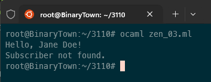

Rust tarafından buraya geçmek gerçekten çok enteresan bir deneyim. Zira yıllardır Rust dilinde **Option**, **Result** gibi önemli veri yapılarını hangi felsefeden geldiğini çok da anlamadan hareket etmişim. Pişmanım :D Neyse neyse... Kodda bir abone listesinden **id** bazlı kullanıcı araması yaptığımız **recursive** bir fonksiyon bulunuyor. Kodun sentaxına bakarken çok fazla bir şey anlamayabiliriz ama **VS Code** ya da **Utop** fonksiyon imzasında **option** döndüğünü açıkça ilan eder.

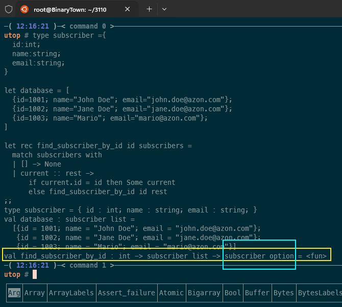

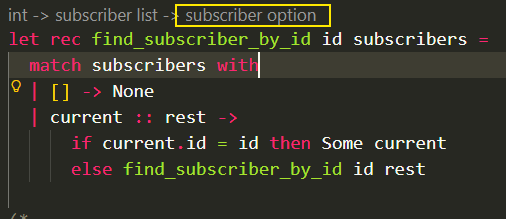

En önemli parça **say_hello** fonksiyonunda yer alan **match** ifadesidir. Burada **result** değişkeninin ya bir abone içerdiği ya da hiçbir şey içermediği durumları ele alınır. Velev ki match ifadesini eksik yazdık. İşte gelen tepkiler...

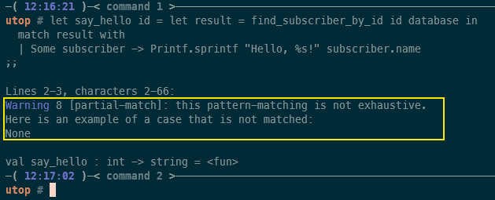

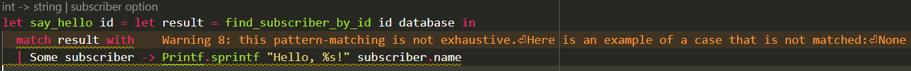

Görüldüğü üzere kaçma şansımız yok. **None** olasılığını da mutlaka kod içerisinde değerlendirmemiz gerekiyor. Buradan hareketle bir değerin olmayışının aslında somut bir veri tipi olduğunu söyleyebiliriz. Yani bir değerin olmayışı da bir durumdur, bu durumun bir tipi vardır ve bu tipin adı **option**'dır. Diğer yandan, **find_subscriber_by_id** fonksiyonu bize bir abone döndirmez esasında. Bunun yerine içinde abone olabilecek bir kutu *(Some veya None)* döndürür. Bir **match** bloğu kullanmadan bir başka deyişle **None** ihtimalini ele almadan kutunun içindeki **name** bilgisine erişmemize derleyici fiziken müsaade etmez. Bu da geliştiricilerin **"burada Null gelmez, ı ıhhh, mümkün değil"** diyerek hareket etmesini engeller.*(Burası ciddi bir kurum asker. İyimserliğe yer yok! Marş marş... :D)* Derleyici olası tüm ihtimalleri değerlendirmemizi bekler. Tabii bu yaklaşımın en güzel yanlarından birisi de huzurlu bir gece uykusudur. Çünkü rüyalarımıza girebilecek herhangi bir **NullReferenceException** öcüsü yoktur.

**Rust** programlama dilindeki `Option<T>` ve hata yönetimi için kullanılan `Result<T,E>` kavramları bu felsefeden gelir. Diğer yandan örneğin **C#** programlama dili çok sonradan **Nullable Type** yeteneği kazanmıştır fakat dilin temel felsefesinde halen **null** diye bir kavram olduğu için bu sonradan eklenmiş bir özellik olarak kabul edilir, bir başka deyişle dilin genlerine işlenmiş matematiksel bir güvence yoktur. Burada genel olarak ifade edilen bir sorunun cevabı da bulunabilir; *Neden modern diller gün geçtikçe OCaml'a benzemeye çalışıyor?*

### Yüksek Matematik Lisanslı Derleyici

Programlama dillerini birçok açıdan ayrıştırabiliriz. Performans ve hıza odaklanıp bazı güvenli alanları kenara bırakanlar, iş modellerini gerçeğe yakın organize edip performanstan ödün verenler gibi. Ancak birde akademik ve endüstriyel olanlar şeklinde iki ana kategoriye de ayrılabilirler. Söz gelimi öğrenmesi görece daha zor olan **Haskell**, **Lisp** gibi diller matematiksel açıdan kusursuza yakındır ancak gerçek dünya problemlerini modellemeye çalıştığımızda bizi daha da zorlayabilir. Diğer yandan **C++**, **Java**, **Go** gibi iş bitirici türden yani endstüriyel çözümlere daha yatkın olan diller de vardır ancak bunlarda kritik hataların oluşmasına müsait dillerdir. Kaynaklar **OCaml** programlama dilinin akademik titizliğe sahip ve endüstriyel olarak da güçlü olduğuna vurgu yaparlar.

Konuyu biraz daha açmaya çalışalım. **OCaml** derleyicisi **[Hindley-Milner](https://en.wikipedia.org/wiki/Hindley%E2%80%93Milner_type_system)** olarak bilinen bir tip sistemini kullanılır. Bu aslında bazı matematiksel enstrümanları ve ispatları barındıran bir yapıdır. Evet evet yanlış duymadınız, matematiksel ispatları dedim :D **Hindley-Milner** tip sistemini baz alan derleyici kodları okuduktan sonra bunları hemen makine diline çevirmez. Öncesinde sembolik mantık ve küme teorisine göre bazı denklemler çözer. Bu çözümler yazılan kodun mantıksal olarak tutarlı olduğunun matematiksel ispatı için işletilir. Dolayısıyla kod derleniyorsa metmatiksel olarak doğrudur *(Akademik anlamda güvenilirdir)*. Bununla birlikte derleyici optimize edilmiş endüstüriyel makine kodu üretir. *(Şu an için ne sizi ne de kendimi bu formüllerle boğmak istemiyorum ama bir ara bu konuyu derinlemesine ele alacağım)*

Bu tip sistemi aklımızın bir köşesinde dursun ve gelin bir örnekle konuyu pekiştirmeye çalışalım. Finansal operasyonların her adımı son derece kritiktir. Büyük bir finans sisteminde farklı türden para birimlerinin olması da kesindir. Örneğin Dolar, Sterlin, Euro gibi para birimlerini göz önüne alalım. Tümü **float** türünden olsalar da bunları birbiriyle yanlışlıkla toplamak faciaya neden olabilir. 1000 Dolar ile 1000 Euro'nun toplanabildiğini düşünün, korkunç... **OCaml** ile bu sorunu nasıl aşabiliriz gelin örnek kod parçası ile bakalım.

```ocaml
(*
  CURRENCY isimli bir modül tanımladık ama bunu bir sözleşme/contract gibi düşünelim.

  Bu sözleşmeye göre var olan bir t tipi için,
  create fonksiyonu float türünden bir değer alarak t türünden bir değer döndürmeli,
  value fonksiyonu t türünden bir değer alarak float türünden bir değer döndürmeli,
  add fonksiyonu ise iki t türünden değer alarak t türünden bir değer döndürmeli.

  Biraz generic constraint'leri hatırlatıyor gibi ;)
*)
module type CURRENCY = sig
  type t
  val create : float -> t
  val value : t -> float
  val add : t -> t -> t
end

(*
  Para birimi için CURRENCY isimli bir sözleşmemiz var.
  Buna göre Euro, Dolar ve Sterlin implementasyonları yapabiliriz.
*)
module Euro : CURRENCY = struct
  type t = float
  let create x = x
  let value x = x
  let add x y = x +. y
end

module Dollar : CURRENCY = struct
  type t = float
  let create x = x
  let value x = x
  let add x y = x +. y
end

module Sterlin : CURRENCY = struct
  type t = float
  let create x = x
  let value x = x
  let add x y = x +. y
end

(*
  Şimdi bu para birimlerinden birkaç değer tanımlayalım
  birbirleriyle toplama işlemi yapmaya çalışalım.
*)
let payment_limit = Euro.create 1000.0
let payment_limit2 = Dollar.create 750.0 
let payment_limit3 = Sterlin.create 650.0

(* Aşağıdaki satır derlenmeyecektir çünkü farklı türler birbirleriyle toplanamaz *)
let total_payment = Euro.add payment_limit payment_limit2
```

Son satırda kasıtlı olarak farklı para birimleri toplanmaya çalışılmaktadır. Bakalım derleyici nasıl tepkiler vermiş.

VS Code ortamından bir görüntü,

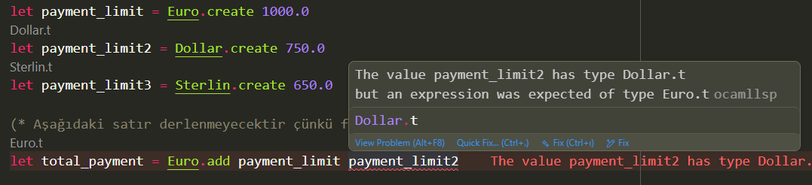

ve terminalden derlemenin sonucu.

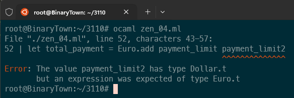

**OCaml** derleyicisi tüm para birimleri **float** veri türünü kullanıyor olsalar da, **CURRENCY** modülünden yapılan implementasyonlar sebebiyle farklı türlerin toplanmasına izin vermeyecektir *(Domain Driven Design tarafında Value Object türleri ile de benzer bir tedbir alınabilir değil mi? Bi düşünün ;) )* Buradaki felsefe şudur; **hataları testler yazarak değil tip sistemini kullanarak derleme zamanında engelle.** Endişe edeceğimiz noktalardan birisi belki de performans kaybıdır ancak burada **Zero Cost Abstraction** söz konusudur. Zira derleyici makine kodunu üretirken **Dollar.t**, **Euro.t** gibi ayrımları silip doğrudan **float** toplama işlemini ele alır.

Bu genler **Rust** diline de geçmiştir ve hatta çok daha şık bir şekilde. Rust dili de **Zero Cost Abstraction** felsefesini benimse ve hatta parasal bir birimi şu şekilde yazmamıza izin veren **Newtype** desenini sunar.

```rust
struct Dollar(f64);
```

C# tarafından olaya baktığımızda sanıyorum en yakın çözüm **record struct** gibi bir türden yararlanmak olacaktır. Nitekim **C#** ve **Java** gibi dillerde bu tür bir korumayı sağlamak için sınıflara başvurduğumuzda bellekte ekstra nesneler oluşmasına neden olup gereksiz **GC** döngülerine sebebiyet verebiliriz. Ancak bu söylediklerimi ispat edebilir miyim, ımmmm, hayır :D

DEVAM EDECEK

[Bu çalışmadaki örneklere ve biraz daha fazlasına github reposundan ulaşabilirsiniz](https://github.com/buraksenyurt/learning-ocaml)
