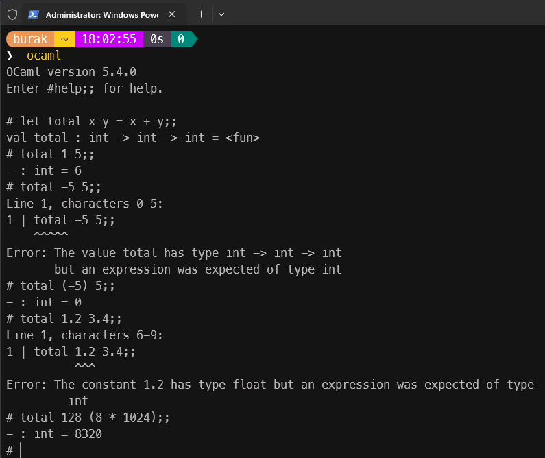
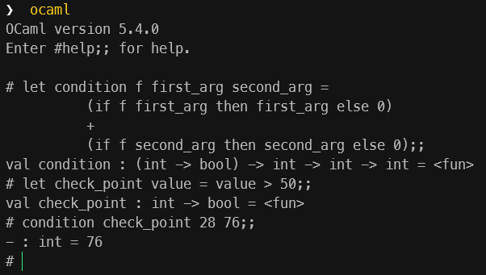
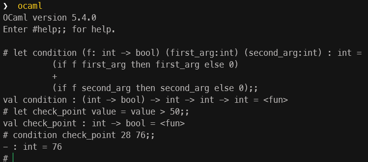
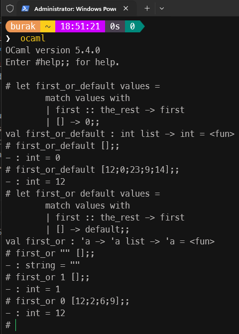

# Learning OCaml

OCaml programlama dili ile ilgili maceralarımın yer aldığı kod deposudur.

## OCaml ile İlgili Merak Ettiğim Sorular

**OCaml ismi nerden geliyor?:**
**Geliştiricileri kim?:**
**İlk versiyonu ne zaman çıktı?:**
**Dilin kullanım amacı:**
**Hangi dillerden esinlenmiş:**
**Hangi dillere esin kaynağı olmuş:** Bir tanesi *Rust* ki bende uğraştığım için biliyorum.
**OCaml ile kendi programlama dilini yazabilir miyim?:**
**Kaynak olarak hangi kitabı tavsiye ederim?:** Real World OCaml, Functional Programming for the Masses, Anıl Madhavapeddy, Yaron Minsky, Cambridge University Press

## Kurulumlar

İlk olarak resmi [OCaml web sitesinden](https://ocaml.org/docs/installing-ocaml) gerekli kurulumları yaptım. Ayrıca VS Code editörüne OCaml eklentisini yükledim. Ancak komut satırından ocaml ile kod çalıştırmakta sorun yaşadım. Bunun kalıcı çözümü içinse aşağıdaki komutu işlettim.

```bash
Add-Content $PROFILE "`n# Initialize opam environment`n(& opam env) -split '\r?\n' | ForEach-Object { Invoke-Expression `$_ }"

#Sonrasında PowerShell'i yeniden başlattım
#Kısa bir versiyon kontrolü yaptım
ocaml -version

#ve örneğin hello-world.ml dosyasını doğrudan aşağıdaki komutla çalıştırabildim
ocaml hello-world.ml

#Ocaml' ı interaktif modda kullanmak için ise aşağıdaki komutu kullanmak yeterli
ocaml
```

İşte ilk programın çıktısı,


## Giriş Seviyesi

Aşağıdaki kod örnekleri için komut satırından `ocaml` komutu çalıştırılarak ilerlenebilir. `ocaml` aracı ile çalışırken kullanılabilecek komutlar için aşağıdaki komut kullanılabilir.

```text
# #help;;
```

### Basit aritmetik işlemler, değişken atamaları ve isimlendirmeler

İlk olarak float değerler ile ilgili aritmetik birkaç işleme bakalım.

```text
# 3.14 +. 2.1;;
- : float = 5.24
# 10+2;;
- : int = 12
# 10+.2;;
Line 1, characters 0-2:
1 | 10+.2;;
    ^^
Error: The constant 10 has type int but an expression was expected of type
         float
Hint: Did you mean 10.?
# 10. +. 2;;
Line 1, characters 7-8:
1 | 10. +. 2;;
           ^
Error: The constant 2 has type int but an expression was expected of type
         float
Hint: Did you mean 2.?
# 10. +. 2.;;
- : float = 12.
# 1_000_000 * 10_000;;
- : int = 10000000000
# (2 * 5) <= 10;;
- : bool = true
# (2 * 6) <= 10;;
- : bool = false
# let xValue = 10;;
val xValue : int = 10
# let y_value = 5;;
val y_value : int = 5
# let result = xValue + y_value;;
val result : int = 15
# let MaxUserCount = 8;;
Line 1, characters 4-16:
1 | let MaxUserCount = 8;;
        ^^^^^^^^^^^^
Error: Unbound constructor MaxUserCount
# let 7even = 7;;
Line 1, characters 4-9:
1 | let 7even = 7;;
        ^^^^^
Error: Invalid literal 7even
# let screen-width = 1024;;
Line 1, characters 11-16:
1 | let screen-width = 1024;;
               ^^^^^
Error: Syntax error
```

- **;;** ile toplevel'a *(bu ne demek?)* ilgili satırı bir ifade olarak ele alması gerektiğini, yani hemen çalıştırmasını belirtmek için kullanılıyor. *(Evaluate Expression)*
- İki **float** değeri toplamak için **+.** operatörü kullanılmalı. Ayrıca **float** ve **int** toplanacak küsürat olmasa bile . ile sayının **float** olarak ele alınacağı ifade edilmeli.
- İfade çalıştırıldığında sadece sonuç değil tür bilgisi de dönülüyor.
- Büyük sayılar **_** karakteri ile daha okunabilir yazılabilir.
- Değişkenleri **let** anahtar kelimesi ile tanımlayabilir ilk değerleri atayabiliriz.
- Değişken isimlendirme kurallarına göre büyük harfle, sayıyla başlayan değişken adları verilemez *(MaxUserCount, 7even)* gibi. Büyük harf kullanılmama sebebi, modül adlarının büyük harfle başlaması olabilir.
- Hatta değişken isimlendirmelerinde **-** operatörü de kullanılamaz.

### let'in Gücü ve Fonksiyon Tanımlamaları

Başla işlemlerle devam edelim. **let** çok güçlü bir operatör. Değişkenleri bağlayabildiğimiz gibi, fonksiyonları da bağlayabiliriz.

```text
# let total x y = x + y;;
val total : int -> int -> int = <fun>
# total 1 5;;
- : int = 6
# total -5 5;;
Line 1, characters 0-5:
1 | total -5 5;;
    ^^^^^
Error: The value total has type int -> int -> int
       but an expression was expected of type int
# total (-5) 5;;
- : int = 0
# total 1.2 3.4;;
Line 1, characters 6-9:
1 | total 1.2 3.4;;
          ^^^
Error: The constant 1.2 has type float but an expression was expected of type
         int
# total 128 (8 * 1024);;
- : int = 8320
```

Burada **total** isimli iki parametre alan ve varsayılan olaran **int** türünde değerleri toplayan bir fonksiyon tanımladık. Fonksiyon çağrılırken parametreler arasında parantez kullanımı önemli. Aksi halde eksi işareti operatör olarak algılanıyor. Ayrıca doğru türlerde işlem yapmak lazım.



```text
# let total_1 x y = x + y;;
val total_1 : int -> int -> int = <fun>
# let total_2 x y = (x * x) + (y * y);;
val total_2 : int -> int -> int = <fun>
# total_1 3 4 + total_2 5 1;;
- : int = 33
# let div x y = Float.from_int x / Float.from_int y;;
Line 1, characters 14-28:
1 | let div x y = Float.from_int x / Float.from_int y;;
                  ^^^^^^^^^^^^^^
Error: Unbound value Float.from_int
Hint:   Did you mean Float.of_int or Float.to_int?
# let div x y = Float.of_int x / Float.of_int y;;
Line 1, characters 14-28:
1 | let div x y = Float.of_int x / Float.of_int y;;
                  ^^^^^^^^^^^^^^
Error: This expression has type float but an expression was expected of type
         int
# let div x y = Float.of_int x /. Float.of_int y;;
val div : int -> int -> float = <fun>
# div 1 3
  ;;
- : float = 0.33333333333333331
# div 3.14 2.
  ;;
Line 1, characters 4-8:
1 | div 3.14 2.
        ^^^^
Error: The constant 3.14 has type float
       but an expression was expected of type int
# div 3 2;;
- : float = 1.5
```

> div fonksiyonunun yorumlanma şekli dikkat çekmiştir. int -> int -> float. Düşününce int,int->float gibi bir şey yazar diye bekliyor insan.

Yukarıdaki örnekte, div isimli fonksiyonu tanımlamaya çalışıyorum. Fonksiyondan beklenti **int** türünden gelen iki sayıyı bölmek ama bunları **float** türünden ele almasını sağlamak. İlk denemede kitaptaki fonksiyon adını unuttum ve **of_int** yerine **from_int** yazdım. **Rust** günlüklerim geldi aklıma, yorumlayıcı *acaba şunu mu demek istedin* derken. Fonksiyonları düzelttikten sonra **/** operatörü ile **/.** arasındaki farka tosladım. **float** türler arasında bir bölme işlemi söz konusu olacağı için **/.** operatörünün kullanılması gerekiyor. Bölme operatörünün tipe özel versiyonlandığını ifade edebiliriz. Ayrıca **Float** bir Ocaml modülü.

Burada rahatsız edici nokta belki de **Float.of_int** kullanımı olabilir ama bunu kolaylaştırmak için OCaml ekosisteminde yazılmış bir başka [modül](https://ocaml.janestreet.com/ocaml-core/v0.13/doc/base/Base/Float/O/) var. Bu modüldeki amaçlardan birisi **float** değerler ile çalışırken +., /. operatörleri yerine +, / ile de çalışabilmek ve bunu **float-safe** modda yapabilmek. Ben şu an için standart kütüphane ile devam etmek istiyorum. Ekosistemdeki diğer modüllere sonradan odaklanırım. Standart kütühane aynı fonksiyonu aşağıdaki gibi yazmamıza da izin veriyor.

```text
# let div x y =
        float_of_int x /. float_of_int y
  ;;
val div : int -> int -> float = <fun>
# div 1 5;;
- : float = 0.2
```

#### Yine de Float.0 ile Çalışmak Gerekirse

Bir noktada Float.O ile çalışmak gerekirse şöyle ilerlemek gerekiyor. Öncelikle komut satırından **utop** başlatılır. Ardından, toplevel, Base modülünü destekleyecek şekilde başlatılır. Bu işlemin ardından ilgili fonksiyon yazılabilir. Aşağıdaki ekran görüntüsünü geleceğe not olarak bırakayım.


### Zihin Yakan Bir Fonksiyon Kullanımı

Şimdi, int türünden değer dönen bir fonksiyonu parametre olarak alan, ve diğer parametrede gelen int değer ile toplayan bir fonksiyon tanımlayalım.

```text
# let more_add f x y = f * x + y;;
val more_add : int -> int -> int -> int = <fun>
# let square n = n * n;;
val square : int -> int = <fun>
# more_add (square 1) 1 1;;
- : int = 2
# more_add (square 2) 3 5;;
- : int = 17
```

İlk olarak **more_add** fonksiyonuna bir bakalım. **f** in bir fonksiyonu işaret ettiğini nereden anladı? Yorumlama kısmına baktığımızda int -> int -> int -> int şeklinde bir tanım var. **\<fun\>** tabii ki bunun bir fonksiyon olduğunu ifade etmekte. f çıktısını x ile çarpıp y ile toplatıyoruz. Saçma bir fonksiyon ancak dinamiğini öğrenmek açısından kayda değer. Sonrasında **square** isimli bir fonksiyon tanımlıyoruz. Bu fonksiyon tek parametre alıyor ve karesini döndürüyor. Şimdi **more_add** fonksiyonunu çağırırken ilk parametre olarak **square 2** ifadesini veriyoruz. Bu ifade **4** değerini döndürecek ve bu değer **f** parametresine bağlanacak. Sonrasında ise 3 ve 5 değerleri sırasıyla x ve y parametrelerine bağlanacak. Yani fonksiyonun işleyişi şu şekilde olacak, 4 * 3 + 5 = 12 + 5 = 17. Ancak asıl zihin yakıcı örnek kitaptaki örnekten esinlenilerek geliyor;

```text
# let condition f first_arg second_arg =
        (if f first_arg then first_arg else 0)
        +
        (if f second_arg then second_arg else 0);;
val condition : (int -> bool) -> int -> int -> int = <fun>
# let check_point value = value > 50;;
val check_point : int -> bool = <fun>
# condition check_point 28 76;;
- : int = 76
```

**condition** isimli fonksiyonun kullandığı **f** parametresi bir fonksiyonu işaret etmekte ve bu fonksiyonun türü **int -> bool**. Yani bir **int** alıp **bool** döndüren bir fonksiyon. Peki yorumlayıcı buna nasıl karar verdi ya da bu tür tahminini *(type inference)* neye göre yaptı? Burada **if** koşuluna odaklanmakta fayda var. Nitekim **else** kısımlarında 0 değeri kullanılmakta ki bu bir **int** türü. Buna göre **then** kısımlarında da **int** türü döndüren ifadeler olmalı. Sonuç olarak **f** fonksiyonu **int -> bool** türünde bir fonksiyon olmalı.



**OCaml** uzmanlarına göre bu yazım stiline ve yorumlayıcının tip tahmini mekanizmasına alışmak zaman alabilir. Diğer yandan dilin çok güçlü bir yanını ispat eden bu yazım stiline alışamayanlar için *Annotations* yani tür açıklamaları ile fonksiyonları tanımlamak da mümkün. Aynı fonksiyonu aşağıdaki gibi de yazabiliriz.

```text
# let condition (f: int -> bool) (first_arg:int) (second_arg:int) : int =
        (if f first_arg then first_arg else 0)
        +
        (if f second_arg then second_arg else 0);;
val condition : (int -> bool) -> int -> int -> int = <fun>
# let check_point value = value > 50;;
val check_point : int -> bool = <fun>
# condition check_point 28 76;;
- : int = 76
```



### Fonksiyonlarda Generic Parametre Kullanımı

OCaml tür tahmini yapma konusundaki hünerini **generic** türler için de gösterir.

```text
# let identity value = value;;
val identity : 'a -> 'a = <fun>
# identity 1001;;
- : int = 1001
# identity "PRD-0001";;
- : string = "PRD-0001"
# let swap (left,right) = (right,left);;
val swap : 'a * 'b -> 'b * 'a = <fun>
# swap (4,"four");;
- : string * int = ("four", 4)
```

**identity** ve **swap** isimli fonksiyonlar tnaımlandıktan sonra yorumlayıcının verdiği çıktılara dikkat edelim. *(Açıkçası Rust'ı öğrenmeye başladığımda hem kavramsal olarak hem de sentaks olarak zorlandığım 'a - lifetime annotations kavramı geldi aklıma)* Her neyse, **'a** ve **'b** şeklinde yazılan ifadeler generic türler. Generic kavramına aşina olmayanlar için *a ve b yerine herhangi bir tür gelebilir ve bunun için her bir türe özel olacak şekilde bu fonksiyonunun farklı versiyonlarını yazmanıza gerek yoktur* diyelim. Şimdi biraz daha kafar karıştırabilecek bir örnek.

```text
# let compare f arg_1 arg_2 =
        if f arg_1 then arg_1 else arg_2;;
val compare : ('a -> bool) -> 'a -> 'a -> 'a = <fun>
# let str_len string = String.length string > 8;;
val str_len : string -> bool = <fun>
# compare str_len "Some..." "Something happens";;
- : string = "Something happens"
# let is_pass score = score > 70;;
val is_pass : int -> bool = <fun>
# compare is_pass 68 50;;
- : int = 50
# compare is_pass "Black" "And White";;
Line 1, characters 16-23:
1 | compare is_pass "Black" "And White";;
                    ^^^^^^^
Error: This constant has type string but an expression was expected of type
         int
```

**compare** isimli fonksiyonumuz yine bir fonksiyon alıp diğer iki argümanı da hesaba katarak bir **if** koşulu işleterek sonuç döndürmekte. **compare** fonksiyonundaki parametrelerin generic **'a** türü olarak yorumlandığa dikkat edelim. Sonraki adımlarda **str_len** ve **is_pass** isimli iki farklı fonksiyon daha tanımlanıyor. İlki, **String** modülünden length fonksiyonunu kullanarak bir değer döndürdüğü için **string** veri türü ile çalışacağı kesin. Diğer fonksiyon ise sayısal bir karşılaştırma kullanıyor ve buna göre de **int** değerler çalışacağı anlaşılıyor. **compare** fonksiyonuna bu iki fonksiyonu parametre olarak verebiliriz ama devam eden argümanların da uygun tipler olması beklenir. Yani **str_len** kullanıyorsak diğer iki argümanın da **string** türünden olması gerekiyor.

### Tuple, List veri türleri

İlk olarak **tuple** veri türü ile ilgili basit bir örnek yapalım.

```text
# let config = ("He-Man, Gölgelerin gücü adına",1920,1080,true);;
val config : string * int * int * bool =
  ("He-Man, Gölgelerin gücü adına", 1920, 1080, true)
# let (title,width,height,is_active) = config;;
val title : string = "He-Man, Gölgelerin gücü adına"
val width : int = 1920
val height : int = 1080
val is_active : bool = true
# let move (x,y) speed =
        (x + speed , y + speed);;
val move : int * int -> int -> int * int = <fun>
# move (10,15) 1;;
- : int * int = (11, 16)
# let (new_x,new_y) = move (11,16) 5;;
val new_x : int = 16
val new_y : int = 21
```

**config** isimli değişken bir tuple veri yapısını işaret ediyor. Tuple veri yapısı farklı türden değerler içerebilen zengin bir model. İstersek tanımladığımız config isimli tuple içeriğini **let** ile başka değişkenlere çıkartabiliriz *(export)* Burada **pattern matching** özelliği olduğunu da görebiliriz. **move** isimli fonksiyon da dikkate değer. İki parametre alıyor ancak x ve y koordinatlarını ifade eden ilk parametre tuple olarak tanımlandı. Ayrıca fonksiyondan geriye yine bir **tuple** döndürmekteyiz.

> Kitapta tuple veri türü tanımında neden **\*** şeklinde bir tanım kullanıldığı da vurgulanıyor. Yani bir tuple tanımlandığında yorumlayıcı bunu okurken *string \* int \* int \* bool* gibi bir ifade kullanıyor. Türlerin toplam kümesini işaret eden bir kartezyen çarpımı söz konusu olduğundan çarpım sembolü kullanılıyor diyebiliriz. Kıssadan hisse, belki de bugün kullandığım Rust, C# , Zig gibi dillerden önce belki de işe OCaml ile başlamak gerekiyordu...

Eğer aynı türnden verilerden oluşan bir listeye ihtiyacımız varsa, pekala **List** veri yapısını kullanabiliriz :D

```text
# let colors = ["Red" ; "Green" ; "Blue"];;
val colors : string list = ["Red"; "Green"; "Blue"]
# let numbers = [1;2;3;4;5];;
val numbers : int list = [1; 2; 3; 4; 5]
# let points = [0.40;0.25;0.55;0.45];;
val points : float list = [0.4; 0.25; 0.55; 0.45]
# let illegal = ["One";"Two";3;"Four"];;
Line 1, characters 27-28:
1 | let illegal = ["One";"Two";3;"Four"];;
                               ^
Error: The constant 3 has type int but an expression was expected of type
         string
# let colors = ["Red" ; "Green" ; "Blue"];;
val colors : string list = ["Red"; "Green"; "Blue"]
# List.length colors;;
- : int = 3
# "Black" :: "White" :: colors;;
- : string list = ["Black"; "White"; "Red"; "Green"; "Blue"]
# colors;;
- : string list = ["Red"; "Green"; "Blue"]
# let extended = "Black" :: "White" :: colors;;
val extended : string list = ["Black"; "White"; "Red"; "Green"; "Blue"]
# extended;;
- : string list = ["Black"; "White"; "Red"; "Green"; "Blue"]
# let another_list = [1,2,3,4,5,6];;
val another_list : (int * int * int * int * int * int) list =
  [(1, 2, 3, 4, 5, 6)]
# let origin = 0,0;;
val origin : int * int = (0, 0)
# "R","G","B";;
- : string * string * string = ("R", "G", "B")
# let left_side = [1;2;3];;
val left_side : int list = [1; 2; 3]
# let right_side = [4;5;6;7;8];;
val right_side : int list = [4; 5; 6; 7; 8]
# let combine = left_side @ right_side;;
val combine : int list = [1; 2; 3; 4; 5; 6; 7; 8]
```

**colors**, **numbers** ve **points** kendi veri türlerinde elemanlar taşıyan birer liste. **illegal** isimli liste ise farklı türden elemanlardan oluşan bir liste yapısı oluşturmak istediğimizde alacağımız hatayı gösteriyor. OCaml'ın **List** modülünde bazı yardımcı fonksiyonlar var. Örnekte listenin uzunluğunu bulmak için **List.length** fonksiyonu kullanıldı. Ayrıca liste başına eleman eklemek için **::** operatörü *(constructor operator)* kullanılmakta. Dikkat edelim, orijinal liste değişmiyor. İlaveler sonrası yeni bir liste oluşuyor. Çalışırken yaptığım hatalardan birisi de liste elemanlarını tanımlarken arada virgül kullanmaktı. Bunu yapınca bir liste yerine tek elemanlı bir tuple listesi oluştu. Dolayısıyla ; ile , kullanımına dikkat etmek gerekiyor. Hatta bir tuple tanımlanırken parantez kullanmasak da, virgül ile ayrılmış değerler bir tuple olarak algılanıyor. **@**, yani add operatörünü kullanarak listeleri birleştirmek de mümkün.

Peki bir liste veri yapısından *pattern matchin* kullanabilir miyiz? Basit bir örnek üstünden ele alalım.

```text
# let first_or_default values =
        match values with
        | first :: the_rest -> first
        | [] -> 0;;
val first_or_default : int list -> int = <fun>
# first_or_default [];;
- : int = 0
# first_or_default [12;0;23;9;14];;
- : int = 12
```

Burada tanımladığımız **first_or_default** isimli fonksiyon **int** türünden bir listenin ilk elemanını döndürüyor ancak burada pattern match ile uyguladığımız bir koşul var. Boş bir liste verilirse varsayılan olarak 0 değerini, aksine dolu bir liste gelirse ki bunu **first :: the_rest** ifadesi ile eşleştiriyoruz *(ilk eleman ve kalanlar anlamında düşünebiliriz)* bu durumda listenin ilk elemanını dönüyor. Yorumlayıcının boş bir liste söz konusu ise 0 döndürülmesinden yola çıkarak fonksiyonun integer bir liste ile çalışacağına kanaat getirdiğine dikkat edelim. Dolayısıyla bu fonksiyonu aşağıdaki gibi yazarsak generic bir versiyon da çıkarmış oluruz.

```text
# let first_or default values =
        match values with
        | first :: the_rest -> first
        | [] -> default;;
val first_or : 'a -> 'a list -> 'a = <fun>
# first_or "" [];;
- : string = ""
# first_or 1 [];;
- : int = 1
# first_or 0 [12;2;6;9];;
- : int = 12
#
```


